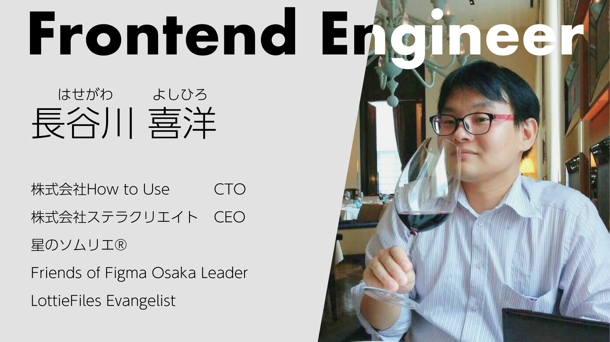

<!-- _class: lead -->
<!-- _paginate: false -->
<!-- _header: "" -->

# 生成AI基礎 第1回
## オリエンテーションとAIの正体

京都芸術デザイン専門学校
クリエイティブデザイン学科 キャラクターデザインコース

---

# 本日の授業目標

1. 生成AIの基本的な仕組みをイメージで説明できる
2. AIの得意・不得意を区別できる
3. 「AIはパートナー」という考え方を理解できる

---

# 本日の流れ

### 1時間目
- 講師自己紹介・オリエンテーション
- そもそも「AI」とは何か
- ワーク：ChatGPTに他己紹介してもらおう

### 2時間目
- AIにできること・できないこと
- クリエイターとAIの関係を考える
- ミニディスカッション
- まとめと次回予告
- 理解度クイズ
- 振り返りシート記入

---

<!-- _class: lead -->

# 1時間目

---

<!-- _class: lead -->

# 自己紹介・オリエンテーション

---

---

# この授業について

### 科目名：生成AI基礎

| 項目 | 内容 |
|---|---|
| 週コマ数 | 2コマ（金曜 1,2講時） |
| 開講期 | 前期（全15回） |

---

# この授業のゴール

AIを **「パートナー」** として使いこなすクリエイターになる

- AIが生成したものを「完成品」として提出する授業 **ではない**
- AIを使って **自分の表現を拡張する** 方法を学ぶ授業

---

# 全15回の流れ

| 回 | テーマ | 区分 |
|---|---|---|
| ①〜③ | AIの基礎知識・倫理 | 基礎編 |
| ④〜⑤ | 言語化とプロンプト技術 | 言語化編 |
| ⑥〜⑧ | 画像生成と選定 | 生成編 |
| ⑨〜⑩ | キャラクター・世界観の一貫性 | 応用編 |
| ⑪〜⑬ | 違和感発見・素材化・制作補助 | 実践編 |
| ⑭〜⑮ | 最終課題・プレゼンテーション | 総仕上げ |

---

# 最終課題

## 設定資料集の制作

短尺アニメやゲームを見据えた、一貫性ある設定画を制作する

- キャラクターデザイン
- 世界観・背景設定
- AIをどう活用したかの説明

---

# 評価基準

| 評価項目 | 割合 | 内容 |
|---|---|---|
| **制作物** | **40%** | 素材化・加筆に向けた設計を理解し表現できる |
| **レポート** | **30%** | AIリテラシーとプロンプト構築力 |
| **修学姿勢** | **30%** | 提出期限・条件を守り積極的に参加 |

---

<!-- _class: lead -->

# そもそも「AI」とは何か

---

# AIの歴史をざっくり振り返る

| 時代 | 何ができた？ | 例 |
|---|---|---|
| 1950〜 | ルールベース | 「もし〜なら〜する」を人間が書く |
| 2000〜 | 機械学習 | データから法則を自分で見つける |
| 2012〜 | 深層学習 | 画像認識・音声認識が急速に進化 |
| 2020〜 | **生成AI** | テキストや画像を「作る」ことができるように |

今みなさんが触れている「AI」は、ほとんどが **生成AI** の世代

---

# 生成AIの仕組みをイメージで理解する

生成AIは「次に来そうなもの」を予測する仕組み

大量のデータからパターンを学習し
新しいものを **"それっぽく"** 生成する

---

# 生成AIの仕組みをイメージで理解する
## LLM（大規模言語モデル）とは？

ChatGPTなどのチャット型AIの中核にあるのが **LLM**

- **L**arge **L**anguage **M**odel（大規模言語モデル）の略
- 大量の文章を読み込んで「言葉のつながり方」を学習したモデル
- 「この言葉の次には、この言葉が来そう」を超高速で繰り返して文章を生成する

次のスライドで、この仕組みを体感してみましょう

---

<!-- _class: lead -->

# 狩野英孝さんを知っていますか？

---

# 狩野英孝さんで理解するLLM

## ラーメンと言えば？

<!-- 1クリック目：問いかけだけ -->

---

# 狩野英孝さんで理解するLLM

## ラーメンと言えば？ → **つけめん！**

<!-- 2クリック目：つけめんが出る -->

---

# 狩野英孝さんで理解するLLM

## ラーメンと言えば？ → つけめん！

## つけめんと言えば？

<!-- 3クリック目：次の問いかけ -->

---

# 狩野英孝さんで理解するLLM

## ラーメンと言えば？ → つけめん！

## つけめんと言えば？ → **僕イケメン！！**

<!-- 4クリック目：オチ -->

---

# 狩野英孝さんで理解するLLM

## ラーメン → つけめん → 僕イケメン！

「ラーメン」と聞いた瞬間、
「つけめん」「僕イケメン」が浮かんだ人も多いのでは？

この **「次に来る言葉が予測できる」** という感覚が
LLMの仕組みそのものです

---

# これがLLM（大規模言語モデル）の仕組み

LLMも同じことをしています

> **「前の言葉から、次に来そうな言葉を予測する」**

「ラーメン」の次は「つけめん」が来そう
「つけめん」の次は「僕イケメン」が来そう

大量の文章データからこの **「次に来そう」のパターン** を学習したのがLLM

---

# ところで：ハルシネーションとは？

もしAIが狩野英孝さんのギャグを **学習していなかったら？**

<!-- 問いかけだけ -->

---

# ところで：ハルシネーションとは？

もしAIが狩野英孝さんのギャグを学習していなかったら？

## ラーメンと言えば？ → **つけ麺！**

<!-- ここまでは合っている -->

---

# ところで：ハルシネーションとは？

もしAIが狩野英孝さんのギャグを学習していなかったら？

## ラーメン → つけ麺 → **担々麺...？**

「それっぽい」けど **間違っている**

---

# これがハルシネーション（幻覚）

AIが **もっともらしいけど事実と異なる内容** を生成すること

- AIは「正しいか」ではなく「それっぽいか」で生成している
- 自信満々に間違えることがある
- だから人間のチェックが必要

**AIの出力を鵜呑みにしてはいけない、という大事な前提**

---

# 画像生成AIの仕組み

テキスト（言葉）→ 画像への変換

1. テキストの意味をAIが解釈する
2. ノイズ（ランダムな点の集まり）から少しずつ画像を形作る
3. テキストの指示に合うように画像を調整していく

言葉による指示が **曖昧だと、AIの解釈もブレる**

---

# AIは「理解」しているのか？

## 答え：理解していない

- AIは意味を理解しているのではなく、**パターンを再現** している
- 「猫」という言葉の意味は知らないが、「猫」と一緒に出てくるパターンは知っている
- だから時々、人間から見ると「おかしな」結果が出る

---

<!-- _class: lead -->

# ワーク：ChatGPTに他己紹介してもらおう

---

# ワークの目的

- **生成AIに実際に触れてみる** — まずは使ってみることが大事
- **AIがどんな風に返してくるかを体感する** — 正確？ それっぽい？

さっき学んだ「LLMは次に来そうな言葉を予測する」を、自分の体験で確かめてみよう

---

# やること

## ChatGPTに自分のことを話して、「他己紹介」を書いてもらう

### 手順

1. **ChatGPTにアクセスする**（アカウントがない人は作成する）
2. **自分のことをChatGPTに伝える**（名前、出身、趣味、好きなキャラ、将来の夢など）
3. **「私のことを他己紹介してください」とお願いする**
4. **生成された他己紹介をスプレッドシートに貼り付ける**

---

# ChatGPTに伝えてみよう

### 伝える内容の例

- 名前・ニックネーム
- 出身地
- 趣味・好きなこと
- 好きなキャラクター・作品
- この学校に入った理由
- 将来やりたいこと

**たくさん伝えるほど、他己紹介の精度が上がる！**
...はたして本当にそうなるか？ 試してみよう

---

# スプレッドシートに記入

生成された他己紹介を読んで、スプレッドシートに貼り付けてください

### 記入する内容
1. **ChatGPTが生成した他己紹介**（そのままコピペ）
2. **合っていたところ・違っていたところ**（一言でOK）

---

# ワークを終えて

- ChatGPTはあなたのことを「理解」していた？
- それとも「それっぽく」まとめていた？

**これがさっき学んだ「パターンの再現」の正体**

AIは相手を理解しているのではなく、
「自己紹介っぽい文章のパターン」に当てはめて生成している

---

<!-- _class: lead -->

# 2時間目

---

<!-- _class: lead -->

# AIにできること・できないこと

---

# AIが「得意」なこと

- **大量生成** — 短時間でたくさんのバリエーションを出せる
- **スタイル変換** — 水彩風、アニメ風、リアル調など画風の切り替え
- **発想の壁打ち** — アイデア出しの相手になってくれる
- **バリエーション展開** — 1つの方向性から複数パターンを展開

---

# AIが「苦手」なこと

- **意図の正確な把握** — 人間の「こうしたい」を完全には読み取れない
- **一貫性の維持** — 同じキャラを毎回同じに描くのが難しい
- **細部の正確な描写** — 指の本数、文字、左右の対称性など
- **「良い」の判断** — どれがベストかを選ぶのは人間の仕事

---

# 成功例と失敗例

### 成功しやすいケース
- コンセプトアートの方向性を探る
- 背景・テクスチャ素材の量産
- 配色パターンのバリエーション出し

### 失敗しやすいケース
- 特定のキャラクターを正確に再現する
- 手や指の細部を正しく描く
- 文字やロゴを含む画像の生成

---

# 「作画の代行」ではなく「パートナー」

| 作画の代行（NG） | パートナー（この授業の考え方） |
|---|---|
| AIに描いてもらって終わり | AIの出力を起点に自分で仕上げる |
| 生成物＝完成品 | 生成物＝素材・たたき台 |
| AIまかせ | 人間が判断・選択・修正する |

**AIは道具でも脅威でもなく、一緒に制作するパートナー**

---

<!-- _class: lead -->

# AIの世界を整理する

---

# サービス名とモデル名は別物

AIの世界は **3つのレイヤー** で整理できる

| レイヤー | 役割 | 車に例えると |
|---|---|---|
| **モデル** | AIの「頭脳」そのもの | エンジン |
| **サービス** | モデルをユーザーが使える形にしたもの | 車 |
| **開発元** | モデルやサービスを作っている会社 | メーカー |

---

# 自社モデル × 自社サービス

エンジンも車も同じメーカーが作っているパターン

| サービス（車） | 提供元（メーカー） | 中のモデル（エンジン） |
|---|---|---|
| ChatGPT | OpenAI | GPT-5.4 / DALL-E 3 |
| Gemini | Google | Gemini 3.1 / Nano Banana 2 / Veo 3.1 |
| Claude.ai | Anthropic | Claude Opus |

---

# 他社モデルを組み込んだ製品

他社のエンジンを積んで、自社ブランドの車として売っているパターン

| 製品（車） | 提供元（メーカー） | 中のモデル（エンジン） |
|---|---|---|
| Microsoft Copilot | Microsoft | GPT / Claude / Grok |
| Notion AI | Notion | GPT / Claude / Gemini |
| GitHub Copilot | GitHub（Microsoft） | GPT / Claude |
| Adobe Firefly | Adobe | Firefly / GPT / Gemini 他 |

---

# 覚えておきたい3つのポイント

1. **同じサービスでも中身のモデルが入れ替わることがある**
   Notion AIがGPTからClaudeに切り替わる、など

2. **同じモデルでも、サービスによって使い勝手が違う**
   GPTはChatGPTでもCopilotでも使えるがUIや機能が異なる

3. **「ChatGPT」≠「GPT-5.4」**
   サービス名とモデル名を区別しよう

---

# チャット型AI：それぞれの特徴

| AI | 特徴 | 注意点 |
|---|---|---|
| **ChatGPT**（OpenAI） | 最も普及。画像生成も統合 | 無料版は機能制限あり。入力が学習に使われる可能性 |
| **Claude**（Anthropic） | 長文読解・丁寧な応答が得意 | 画像生成機能は限定的 |
| **Gemini**（Google） | Google連携が強み。マルチモーダル | 創作系タスクがやや弱い場面も |

---

# 画像生成AI：それぞれの特徴

| AI | 特徴 | 注意点 |
|---|---|---|
| **Midjourney** | アート性が高い。クリエイター人気◎ | 有料のみ。Discord操作が基本 |
| **Stable Diffusion** | オープンソース。カスタマイズ性最高 | 環境構築のハードルが高い |
| **DALL-E**（ChatGPT内蔵） | ChatGPTから直接使える手軽さ | カスタマイズ性は低め |
| **Adobe Firefly** | 著作権リスク低。Adobe製品と統合 | 表現の幅がやや限定的 |
| **Nano Banana 2**（Gemini内蔵） | 一貫性の保持が得意 | SynthID（電子透かし）の削除禁止 |

---

# 共通の注意点

- **著作権** — AIを「道具」として使用したものについては認められる可能性がある
- **学習データ** — 他者の作品が学習に使われている可能性がある
- **プライバシー** — 入力した情報がAI側に保存・学習される場合がある
- **依存リスク** — AIに頼りすぎると自分の画力・発想力が育たない

---

<!-- _class: lead -->

# クリエイターとAIの関係を考える

---

# プロの現場でのAI活用例

| 活用シーン | 使い方 |
|---|---|
| コンセプトアート | 初期段階のイメージ探りに大量生成 |
| ラフ案出し | 構図やポーズのアイデア出し |
| 背景素材 | ベースとなる背景を生成し、加筆修正 |
| 配色検討 | カラーバリエーションを素早く比較 |
| テクスチャ | 素材パターンの生成 |

いずれも **「生成して終わり」ではなく、制作工程の一部** として活用

---

# AIが得意なことは任せる

**人間がやるべきこと**
- コンセプトを決める
- 「良い」「悪い」を判断する
- 細部を修正・仕上げる
- 一貫性を保つ
- 物語や感情を込める

**AIに任せられること**
- 大量のバリエーション生成
- スタイル変換・画風展開
- 素材のベース作成
- アイデアの壁打ち

---

# 「AIを使いこなす」ために必要なこと

1. **言語化する力** — 自分のイメージを言葉で正確に伝える
2. **選ぶ力** — 大量の生成物から「良いもの」を見抜く
3. **直す力** — AIの出力を自分の手で仕上げる
4. **判断する力** — 倫理的に問題がないかチェックする

この4つの力を、これから15回の授業で身につけていく

---

<!-- _class: lead -->

# ミニディスカッション

---

# ディスカッションテーマ

## 「AIに対して、どんなイメージや不安がありますか？」

### 以下の3つについてグループで話し合い、発表してください

1. AIを使ったことはある？ どんな場面で？
2. AIに対してポジティブなイメージ？ ネガティブ？
3. クリエイターとしてAIをどう思う？

### 進め方
1. 3〜4人のグループに分かれる
2. 3つのテーマについて話し合う（15分）
3. 各グループから発表（15分）

---

<!-- _class: lead -->

# まとめ

---

# 本日のまとめ

### 生成AIの仕組み
- 大量のデータからパターンを学習し、「次に来そうなもの」を予測・生成する
- 「理解」ではなく「パターンの再現」

### AIの得意・不得意
- 得意：大量生成、スタイル変換、バリエーション展開
- 苦手：意図の把握、一貫性、細部の正確さ、価値判断

### この授業のスタンス
- AIは「作画の代行」ではなく「パートナー」
- 生成物は完成品ではなく、素材・起点として活用する

---

<!-- _class: lead -->

# 理解度クイズ

---

# 次回の授業

## 第2回：チャット型生成AIで発想を広げる

- ChatGPTなどのチャット型AIを実際に使ってみる
- 「情報収集」ではなく「発想補助」「整理補助」としての活用
- 人間が書いた文章と生成AIが書いた文章の違いを体感する

---

<!-- _class: lead -->

# 振り返りシート記入

## 本日の行動目標

1. 生成AIの基本的な仕組みをイメージで説明できる
2. AIの得意・不得意を区別できる
3. 「AIはパートナー」という考え方を理解できる

---
