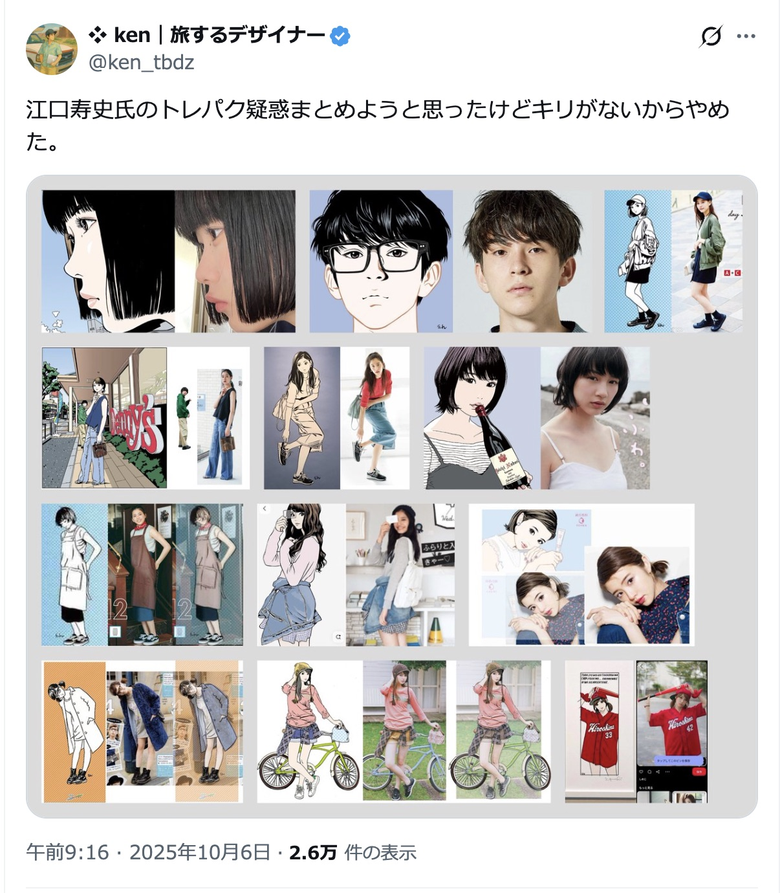
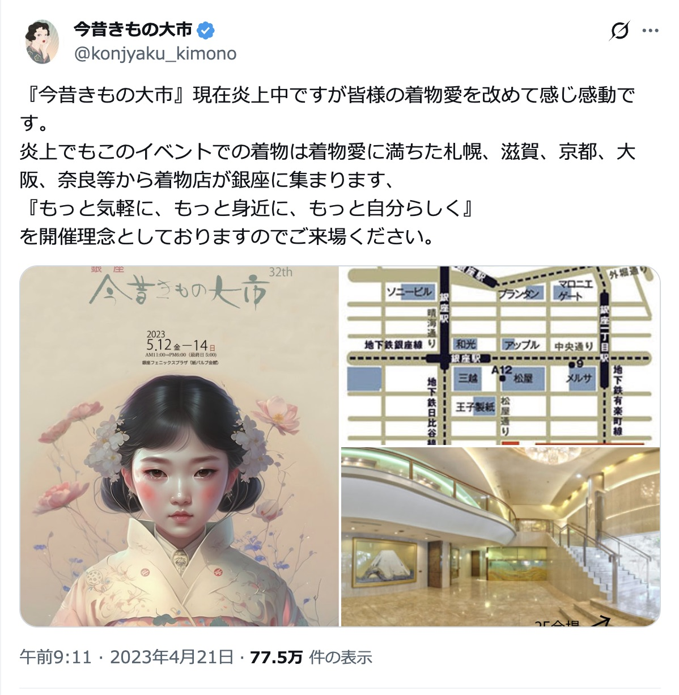

<!-- _class: lead -->
<!-- _paginate: false -->
<!-- _header: "" -->

# 生成AI基礎 第3回
## AI活用ガイドラインと倫理

京都芸術デザイン専門学校
クリエイティブデザイン学科 キャラクターデザインコース

---

# 本日の授業目標

1. 著作権の基本（**依拠性／類似性／3つの段階**）と生成AIの関わりを説明できる
2. **機密情報・個人情報・他者の作品**をAIに入力する際のリスクを判断できる
3. 自分のAI活用における「やる／やらない」の線引きを言語化できる

---

# 本日の流れ

### 1時間目
- 前回の振り返り
- なぜ今、倫理を学ぶのか
- 著作権の基本
- ワーク①：これって権利侵害？ ケーススタディ

### 2時間目
- 入力データのリスク／安全活用の3つのルール
- AI生成物の権利は誰のもの？
- ワーク②：自分のAI活用ガイドラインをつくる
- まとめ・クイズ・振り返り

---

<!-- _class: lead -->

# 1時間目

---

# 前回のキーワードを思い出そう

### チャット型AIは「情報収集」より「発想補助／整理補助」

- 1回で終わらず **対話を往復** させて育てる
- AIに任せると **AI文体** になる。決めるのは自分
- 「100個出して」「3つに分けて」など **指示の型** を持つ

今日はこの「使い方」の手前にある **ルール** の話

---

<!-- _class: lead -->

# なぜ今、倫理を学ぶのか

---

# クリエイターは「描く力」と「責任」がセット

AIで一瞬で絵が出せる時代になっても、
**作品を世に出した人が責任を持つ** 構造は変わらない

- 誰の絵柄を真似たのか
- 何を入力に使ったのか
- それを **どこに出した** のか

すべてあなたの判断、あなたの責任

---

# 「知らなかった」では済まないこと

実際に起きていること

- SNSで「絵柄を真似たAI画像」を上げて炎上
- クライアントワークでAI使用がバレて契約解除
- 著作権侵害として **損害賠償請求**
- 学校の課題で他人の未公開素材を入力 → 守秘義務違反
- 就活時、ポートフォリオのAI画像で **印象悪化**

ルールを **知らない** ことそのものがリスクになる

---

# これは「AIだけ」の問題ではない

著作権・パクリの問題は、AI登場のずっと前からある
**人間が描いた絵でも** 同じことが起きる

最近の2つの実例を見ながら考える

| 事例 | 何が論点か |
|---|---|
| **江口寿史 トレース騒動**（2025） | 人間のイラストでも「依拠性＋肖像権」が問われる |
| **AI生成・着物ポスター 左前事件**（2023） | AI画像を **そのまま採用** したことの炎上リスク |

---

# 事例①：江口寿史 トレース騒動（2025）

人気漫画家の **告知ポスター（中央線文化祭2025／ルミネ）** が、
SNSの一般女性の写真を **本人に無許可で** 参考にしていたことが発覚

- 桜美林大学・Zoff・セゾンカード等、過去案件にも疑惑が波及
- 写真の被写体本人がルミネに通報、弁護士を介して **和解**
- 江口氏は2025年12月30日にXで謝罪と釈明

> 「トレースは絵を描く上での正当な段階のひとつ」（江口氏）
> 一方で「知らないところで自分に似た絵が描かれて
> 不安になる人もいる。配慮が足らなかった」とも

<span class="cite">参考：J-CASTニュース／ITmedia NEWS／オリコン（2025年12月）</span>

---

# 事例①：江口寿史 トレース騒動（2025）



<span class="cite">Xからの引用</span>

---

# 事例①からの学び

「人が描いた」イラストでも、**依拠性＋類似性** が認められれば
著作権・肖像権・パブリシティ権の問題になる

- **写真は撮った人の著作物**（被写体には肖像権／場合によりパブリシティ権）
- 「資料としてSNS写真を見た」だけでも、**そっくり** に描けば問題になる
- 同じ構造が、AIの **Image to Image** でも起きる（後述）

> AI以前から、著作権の物差しは **同じ**
> 「依拠性」「類似性」は今日この後ずっと出てくるキーワード

---

# 事例②：AI画像・着物ポスター「左前」（2023）

「銀座今昔きもの大市」の告知ポスターで、
AI生成のフリー素材を使ったところ
着物が **左前**（亡くなった方の着付け＝死装束）に

- SNSで「左前は駄目でしょ」「死装束では」と批判殺到
- 主催者は **修正せず**「ファッションに決まりごとはない」と回答
- 結果として **イベントの印象に深刻なダメージ**

<span class="cite">参考：J-CAST「着物イベントの『左前』ポスターが物議」（2023年4月）</span>

---

# 事例②：AI画像・着物ポスター「左前」（2023）



<span class="cite">Xからの引用</span>

---

# 事例②からの学び

法律上の **著作権侵害ではない** が、**炎上リスクは法律と別** に存在する

- AIは「**もっともらしい嘘**」をビジュアルでも出す
- 文化的な常識（左前／右前、季節感、紋章、宗教モチーフ）は外しがち
- **クリエイターによる最終チェックがない** と、ブランドが傷つく

> 「AIに作らせた」では言い訳にならない
> 出した人が責任を負うのは、絵でも文章でも同じ

---

# 倫理を学ぶ ＝ 創造性の萎縮ではない

「あれもダメ、これもダメ」を覚える時間ではない

> **「どこまでなら自由に動けるか」を確認する時間**

ラインがわかれば、その手前では大胆に動ける
わからないと、何をしても怖い

そして、これは **AIだけの新しい問題ではない**
これまでの著作権・パクリ問題の **延長線上** にある

---

<!-- _class: lead -->

# 著作権の基本

---

# 著作権ってそもそも何？

## 作った人の権利を守る仕組み

- 絵、文章、音楽、映像、写真... すべて対象
- 「勝手に使われない／真似されない」を守る
- 申請しなくても、**作った瞬間に発生する**

そして... AI時代だから新しくできたルールではなく、
**昔からあるルールがAIにも当てはまる**

---

# 著作物の定義（著作権法）

> 「思想又は感情を **創作的に表現** したものであつて、
> 文芸、学術、美術又は音楽の範囲に属するもの」
> （著作権法 第2条第1項第1号）

ポイントは3つ

- **思想・感情** がある（単なるデータではない）
- **創作的に** 表現されている（ありふれていない）
- **表現** されている（頭の中のアイデアではない）

---

# 保護される著作物の例

| 種類 | 例 |
|---|---|
| 言語 | 講演、論文、レポート、小説、脚本、詩、俳句 |
| 音楽 | 楽曲、歌詞 |
| 舞踊・無言劇 | 日本舞踊、バレエ、ダンス、パントマイムの振付 |
| **美術** | **絵画、版画、彫刻、マンガ、書、舞台装置、工芸** |
| 建築 | 芸術的な建築物 |
| 地図・図形 | 地図、設計図、立体模型、地球儀 |
| 映画 | 劇場用映画、アニメ、ビデオ、ゲームの映像 |
| 写真 | 肖像写真、風景写真、記録写真 |
| プログラム | コンピュータ・プログラム |

<span class="cite">出典：文化庁「AIと著作権Ⅱ」p.5</span>

---

# 保護対象に「含まれない」もの

- 単なる事実やデータ
- ありふれた表現
- **表現でないアイデア**（作風・画風など）
- 工業製品

> 「〇〇先生の **画風** で」というプロンプト自体は、
> 画風＝アイデアの領域なので **画風そのもの** は保護されない
> ただし「特定作品にそっくり」になると話は別（後述）

---

# 「表現」と「アイデア」

なぜアイデアは保護されないのか？

- アイデアを独占できると、**新しい創作が生まれにくくなる**
- 自由に使えるからこそ、表現の **多様性** が生まれる
- 結果として「文化の発展」につながる、と考えられている

> アイデアと表現の **境目** は、ケースごとに判断
> 「ここまではアイデア／ここからは表現」が **難しいケースも多い**

---

つまり
# 画風はアイデア／作品は表現

---

# 例：レシピと冊子

| 何が著作物？ | 解説 |
|---|---|
| **レシピそのもの** | アイデア → **保護されない** |
| レシピを載せた **冊子・動画** | 具体的な表現 → **保護される** |

- 「カレーの作り方」というアイデアは独占できない
- でも、その料理本の **文章・写真・レイアウト** はその人のもの
- AI生成物の議論も、これと同じ目線で考える

---

# 侵害かどうかを決める2つの言葉

| 言葉 | 文化庁の定義 |
|---|---|
| **依拠性（いきょせい）** | 既存の著作物に **接して**、これを自らの作品の中に **用いる** こと |
| **類似性（るいじせい）** | 既存の著作物の表現上の **本質的な特徴を直接感得** できること |

ざっくり言うと

- **依拠性** ＝ 既存作品を **参考にしたか**（接した機会があるか）
- **類似性** ＝ 外見が **似ているか**（表現が一致しているか）

**両方そろうと、著作権侵害の可能性が高い**

---

# 非享受目的なら侵害にあたらない

「享受」＝ 著作物を **楽しむ／鑑賞する／味わう** ために使うこと
それ **以外** の目的の利用は、原則として侵害にならない

| 目的 | 例 | 判定 |
|---|---|---|
| **享受目的** | 絵を鑑賞する／作品として発表する／販売する | 著作権が及ぶ |
| **非享受目的** | AIの学習データとして読み込ませる／検索インデックス化／情報解析 | 原則 **侵害にならない**（著作権法30条の4） |

> 「中身を味わうために使うのか」「処理のために通すだけか」
> この違いが、**侵害／非侵害の分かれ目**

<span class="cite">参考：著作権法第30条の4／文化庁「AIと著作権Ⅱ」</span>

---

# 例で考えてみよう

| ケース | 依拠性 | 類似性 | 判定 |
|---|---|---|---|
| 元の作品を見ずに、偶然似たものを描いた | ❌ | ⭕️ | 侵害になりにくい |
| 元作品を見て描いたが、別物に仕上げた | ⭕️ | ❌ | 一般に問題になりにくい |
| 元作品を参考にして、そっくりに仕上げた | ⭕️ | ⭕️ | **侵害の可能性大** |

「似てる／似てない」だけでは決まらない
**江口寿史事件** はまさに3つ目のケース（依拠性⭕️＋類似性⭕️）に入った疑いをかけられた

---

# 生成AIで気をつける「3つの段階」

| 段階 | 何が起きる？ | 主な論点 |
|---|---|---|
| ① **学習** | 大量データをAIに読み込ませる | 誰のデータが使われた？ |
| ② **生成** | プロンプトで画像・文章を出力 | 既存作品にそっくりにしてないか？ |
| ③ **利用** | SNS投稿・提出・販売 | 用途は許されている？ |

「AIで作った」だけでまとめて議論しない

---

# ① 学習段階：著作権法第30条の4

> 情報解析等に伴う著作物の利用＝
> 「著作物に表現された **思想又は感情の享受を目的としない** 利用」
> は、原則として **著作権者の許諾なく** 行うことができる

つまり

- AIの学習データとして著作物を **複製・収集することは原則OK**
- ただし以下は **NG**：
  - 不当にアップロードされた違法データ（海賊版）を使う
  - 「情報解析用としてライセンスされた素材」を勝手に使う
  - 特定クリエイターの作品 **だけ** を集中的に学習させ、類似物を作る目的

---

# ② 生成段階で起きやすい問題

### 「Image to Image」の落とし穴

他人のイラストを入力して「これに似たものを」と生成する行為

- AI利用者がその作品を **明確に認識して使った** 証拠になる
- → **依拠性が認められやすい**
- 出力が元イラストと似ていれば、**著作権侵害**

### そもそも入力する行為そのもの
- 著作権者の許諾なく他人のイラストをAIに **入力・アップロード**
- これ自体が **著作権侵害になり得る**

---

# ③ 利用段階：誰が責任を負う？

- 原則：**生成AIを使って生成を行った人** が責任を負う
- 場合によっては AI開発者・提供者が責任を負うこともある
- 生成画像に **依拠性＋類似性** が認められれば著作権侵害

### 法律上OKでも...

> クリエイター感情・大衆感情として認められないケースは多い
> SNSで **炎上するリスク** は法律とは別に存在する

**着物・左前ポスター事件** はこのパターン
（著作権侵害ではないが、ブランドは傷ついた）

---

<!-- _class: lead -->

# ワーク①：これって権利侵害？

---

# ワークの目的

- **白黒つけることではなく、判断の根拠を言葉にする**
- 「依拠性」「類似性」「3つの段階」の物差しを使ってみる
- グループで話し、自分と違う視点に触れる

---

# やること

### 6つのケースを、グループで判定

1. グループに分かれる
2. ケース1〜6をすべて読む
3. 各ケースを **「OK／グレー／NG」** で判定し、**理由** を書く
4. **スプレッドシートに記入**（15分）
5. 任意で発表 → 解説（10分）

---

# ケース1

> ある漫画家さんの絵柄が大好き。
> プロンプトに「〇〇先生風で」と書いて
> オリジナルキャラを生成。Xに投稿した。

**判定とその理由は？**

---

# ケース2

> 既存アニメのキャラクター画像をAIに読み込ませて
> 「同じポーズで、別キャラに置き換えて」と指示。
> 出てきた画像を友達にLINEで送った。

**判定とその理由は？**

---

# ケース3

> 友達の顔写真を本人に無許可で
> 「アニメ風に変換」してSNSに投稿。
> 「めっちゃ可愛くなったよ」とタグ付き。

**判定とその理由は？**

---

# ケース4

> 卒業制作の自分のイラストの背景に、
> AIで生成した街並みを合成して提出。
> AI使用については特に明記しなかった。

**判定とその理由は？**

---

# ケース5

> 「今期アニメっぽい雰囲気の女の子」と
> AIに大量の設定案を出させ、その中から選び、
> **自分の手でゼロから絵を描いて** 投稿した。

**判定とその理由は？**

---

# ケース6

> 「商用利用OK・著作権フリー素材だけで学習」と
> うたっているAIサービスで画像を生成し、
> グッズにして販売した。

**判定とその理由は？**

---

# 発表 → 解説

任意で発表してください

- どんな判定にしたか
- なぜその判定にしたか
- グループ内で意見が割れたところはどこか

**判定そのものより、「判断の言葉」を共有することが目的**

---

<!-- _class: lead -->

# 2時間目

---

<!-- _class: lead -->

# 入力データのリスク

---

# AIに「何を入れるか」も大事

ここまでは「何を出すか」の話だった

実は、**入力する側にも大きなリスクがある**

- 入れた情報がAI側に **残る／学習される** ことがある
- 特に **無料版** はデータ利用の前提が緩いことが多い

---

# 入れてはいけないもの

| カテゴリ | 例 |
|---|---|
| **クライアントの未公開資料** | 預かった原稿、設定、台本、企画書 |
| **個人情報** | 本名・住所・電話番号・未公開SNS |
| **学校の未公開資料** | 配布された素材、他人の課題、答案 |
| **第三者の著作物** | 他人の絵、写真、文章をそのまま入力 |

「入力＝外部に渡している」と考えるのが安全

---

# 学習をオフにする設定

主要サービスには **データを学習に使わない設定** がある

- ChatGPT：設定 → データコントロール
- Claude：デフォルトで学習に使わないと公表
- Gemini：履歴・学習設定

ただし...
- 設定は **アカウント単位**、無料版では制限あり
- 「学習に使わない」≠「サーバーに保存されない」
- **入れた事実は消えない** と思った方が安全
- いつ変更されるか分からない

---

# 安全にAIを活用する「3つのルール」

著作権侵害を避けるための実務ルール

### 1. 類似物になっていないか確認する
公開する前に、画像検索などで **既存作品と似ていないか** チェック

### 2. 他人の作品をそのまま入力しない
「Image to Image」などで **他人のイラスト** を入力し
それに似たものを生成させない

### 3. プロンプト（生成過程）を保存しておく
「真似する意図はなかった」と説明できるように
**生成に使った指示文** を残しておく

---

<!-- _class: lead -->

# AI生成物の権利は誰のもの？

---

# 「AIで作ったもの」に著作権はある？

## 結論：場合による

日本の現在のおおまかな考え方（2026年時点）

- AIが **自動で出しただけ** のものは権利が認められにくい
- 人間の **創作的寄与** が多いほど認められやすくなる

---

# 「創作的寄与」って何？

人間が **どれだけ手をかけたか**

| 関わり方 | 創作的寄与 |
|---|---|
| プロンプトを「猫」とだけ入れた | 弱い |
| 詳細な設定・構図・修正指示を重ねた | やや強い |
| 大量生成から選別し、加筆修正した | 強い |

**この授業で学ぶワークフロー＝創作的寄与を増やす** ことでもある

---

# 商用利用 vs 非商用利用

サービスごとに **利用規約で決まる**

- 「無料版は商用利用不可」のケースもある
- 同じモデルでも、サービス経由か直接APIかで条件が変わる
- 「自分の作品として販売してOK」かは **必ず利用規約を確認**

「とりあえず売ってみた」が一番危ない

---

# AIで作った印：SynthID／C2PA

最近の動き：「これはAI製ですよ」を **見えない形で埋め込む** 技術

- **SynthID**（Google）：透かしを画像に埋め込む
- **C2PA**：制作工程の記録を画像に紐づける

> 透かしを **意図的に外すのは禁止行為** とされていることが多い
> 「AIで作ったことを隠す」目的の加工は危険

---

# クレジットはどう書く？

「AI使用」を明示するかどうか

- 公募・コンペ：規約で **必須** のことが多い
- SNS：明示する人も、しない人もいる
- 仕事：クライアントとの契約で必ずすり合わせ

> **隠して使ってバレる** のが一番ダメージが大きい
> どこに出すかで、出し方を変える

---

<!-- _class: lead -->

# ワーク②：自分のAI活用ガイドライン

---

# ワークの目的

- 「禁止」を覚えるのではなく、**自分の線を引く** 練習
- 言葉にしておくと、迷ったときに **判断が早くなる**
- 定期的にアップデートしていく **第1版** を作る

---

# やること

### 自分用の「AI使用ルール」を3〜5項目で書く

観点の例（全部書かなくてよい、迷ったらここから選ぶ）

- **入力**：何は絶対に入れない？
- **生成**：誰の絵柄・誰のキャラを真似ない？
- **利用**：商用は？ SNSに出すときの基準は？
- **提出**：授業課題でAI使用を明示する？
- **クレジット**：どんな書き方をする？

---

# 書き方のフォーマット

```
■ 私のAI活用ガイドライン v1

入力…クライアントから預かった素材は、無料版AIに入れない
生成…「〇〇先生風」など特定のクリエイター名はプロンプトに書かない
利用…SNS投稿時、AI生成画像には #AIart を必ずつける
提出…授業課題でAIを使った場合、レポートに使用範囲を明記する
クレジット…迷ったら、提出前に先生か友達に相談する
```

スプレッドシートに記入してください

---

<!-- _class: lead -->

# まとめ

---

# 本日のまとめ（1/2）

### 著作権の基本
- 守るのは **表現**、守らないのは **アイデア**（画風・作風）
- **依拠性** ＋ **類似性** がそろうと侵害の可能性大
- 例：レシピ＝アイデア（保護されない）／レシピ本＝表現（保護される）

### 生成AIをめぐる3段階
| 段階 | キーポイント |
|---|---|
| ① 学習 | **30条の4**：原則、許諾なくデータを読み込ませてOK |
| ② 生成 | **Image to Image** は依拠性が認められやすく要注意 |
| ③ 利用 | 生成して使った人が責任を負う／法律OKでも炎上リスクあり |

---

# 本日のまとめ（2/2）

### 入力データと安全活用
- 無料版AIは「外部に渡す」と思って使う
- **クライアント資料／個人情報／他人の作品** は入れない
- **3つのルール**：①類似チェック ②他人作品を入れない ③プロンプト保存

### 生成物の権利
- 自動で出しただけのものは権利が認められにくい
- **人間の創作的寄与**（プロンプト設計／選別／加筆）が増えるほど守られる

### あなたのスタンス
- 「ダメ」を覚えるのではなく、**自分の線を言葉にしておく**

---

# 今日の事例から覚えておきたいこと

| 事例 | キーワード |
|---|---|
| 江口寿史 トレース騒動（2025） | **依拠性＋類似性**、肖像権、AI以前から同じ |
| AI画像・着物左前ポスター（2023） | **法律OKでも炎上**、文化的常識、最終チェック |

「人が描いた」「AIが描いた」を問わず、
出した人が **責任を引き受ける** ところは同じ

---

<!-- _class: lead -->

# 理解度クイズ

---

# 参考資料

### 文化庁

- 令和6年度著作権セミナー「AIと著作権Ⅱ」
  https://www.youtube.com/watch?v=bD0Kp5PiP8o
- 「AIと著作権II」資料（PDF）
  https://www.bunka.go.jp/seisaku/chosakuken/pdf/94097701_02.pdf

### 今日紹介した事例の参考

- J-CASTニュース「江口寿史氏『トレパク疑惑』問題で見解」（2025年12月）
- ITmedia NEWS「"トレパク騒動"江口寿史さんが釈明」（2025年12月）
- J-CAST「着物イベントの『左前』ポスターが物議」（2023年4月）

> 本日のスライド中の図版（フローチャート、グラデーション図、フロー全体図ほか）は
> 文化庁「AIと著作権Ⅱ」資料からの引用です

---

# 次回の授業

## 第4回：キャラクター設定の言語化

- シナリオから性格・背景・外見的特徴を「言葉」で詳細に定義する
- 描かずに、まず **言葉で設計する** トレーニング
- 第5回のプロンプトエンジニアリングへの土台づくり

---

# 振り返りシート記入

## 本日の行動目標

1. 著作権の基本（依拠性／類似性／3つの段階）と生成AIの関わりを説明できる
2. 機密情報・個人情報・他者の作品をAIに入力する際のリスクを判断できる
3. 自分のAI活用における「やる／やらない」の線引きを言語化できる
