<!-- _class: lead -->
<!-- _paginate: false -->

# 動画基礎 第1回
## オリエンテーションと映像制作の流れ

2026年9月25日（金）
京都芸術デザイン専門学校
クリエイティブデザイン学科 キャラクターデザインコース

---

<!-- _class: hook -->

# この授業で、あなたは
# **2本の動画を"納品"します**

## 学校の課題ではなく、企業に届ける本物の動画

---

<!-- _class: hook -->

# 撮るのは **スマホ**
# 編集は **Premiere Pro**

## 特別な機材はいらない。今日から始められる

---

# 本日の授業目標

1. 授業目標と **2つの企業連携課題** を理解する
2. **スマホ・Premiere** の制作環境を確認する
3. **著作権・肖像権・AI素材** の扱いを確認する

---

# 本日の流れ

### 1時間目
- 講師自己紹介・みなさんに質問
- この授業で作る2本の動画
- 全15回のロードマップと評価
- 映像制作の流れ・動画の正体（fps・解像度・縦横）

### 2時間目
- 制作環境の確認（Premiere Pro・スマホ・データの受け渡し）
- 著作権・肖像権・AI素材クイズ
- ミニ演習：撮る → 転送 → 読み込む → 再生
- まとめ・次回予告・宿題

---

<!-- _class: lead -->

# 1時間目

---

<!-- _class: lead -->

# 自己紹介・オリエンテーション

---

# 担当講師

| 講師 | 実務経験 |
|---|---|
| **小畑タカユキ** | AI駆動型Web制作、DX推進、イベント企画運営。クリエイティブ領域でAIを活用し、制作から実証までのワークフロー最適化を実践 |
| **長谷川 喜洋** | Web制作と教育。HTML/CSS/JavaScript開発、アクセシビリティ、デジタル制作 |

<!-- 各自でひとこと自己紹介。「動画で一番好きなジャンル」を添えると距離が縮まる -->

---

# まず、みなさんに質問

### 手を挙げてください

- スマホで動画を撮って **SNSに投稿したことがある** 人
- **CapCut・iMovie・Premiere** など、編集アプリを使ったことがある人
- **TikTok・リール・ショート** を1日30分以上見ている人
- 「バズった動画」を **自分で作ってみたい** と思ったことがある人

<!-- 経験値を把握して、以降の説明の深さを調整する。最後の質問で盛り上げる -->

---

# この授業について

### 科目名：動画基礎

| 項目 | 内容 |
|---|---|
| 週コマ数 | 2コマ（金曜 1,2講時） |
| 開講期 | 後期（全15回） |
| 学ぶこと | スマホ撮影 ＋ Premiere Pro編集 |
| 作るもの | 企業連携課題 **2本** |

---

# この授業のゴール

## 「企画意図に沿って、短い映像を完成させられる」

- 撮影 → 構成 → 編集 → 音 → 書き出しを **自分の手で** 一通りできる
- 前半は **ひとりで** 、後半は **チームで** 作る
- 対象（見る人）に **届く** プロモーションを提案できる

> 上手い動画より、**「誰に何を伝えるか」がはっきりした動画** を目指す

---

<!-- _class: lead -->

# この授業で作る2本の動画

---

<!-- _class: projectA -->

# 企業連携課題① 昭和レトロ横丁のショート動画

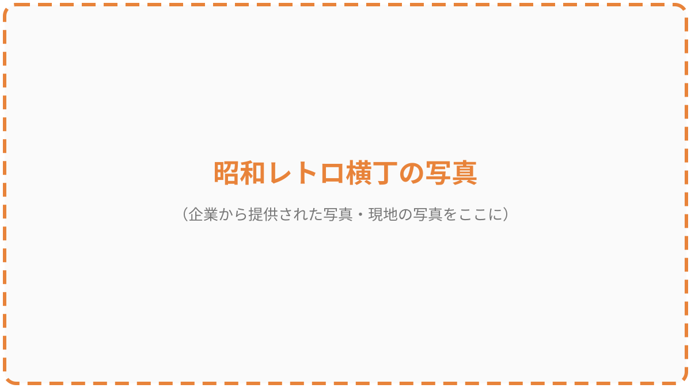

<!-- 企業提供の写真や現地の写真に差し替える。連携先の名前・場所・依頼の背景をここで話す -->

---

<!-- _class: projectA -->

# 課題①はこんな動画

| 項目 | 内容 |
|---|---|
| 尺 | **15〜30秒** |
| 形 | **縦動画**（TikTok・リール・ショート向け） |
| 制作 | **ひとりで** 1本 |
| 撮影 | **11/6 現地でフィールドワーク**（スマホ1台でOK） |
| 納品 | 第8回（11/20）上映会 → 企業へ納品 |

**昭和の空気感を、スマホの縦画面でどう切り取る？**

---

<!-- _class: projectB -->

# 企業連携課題② 自転車啓発ノベルゲームのPV

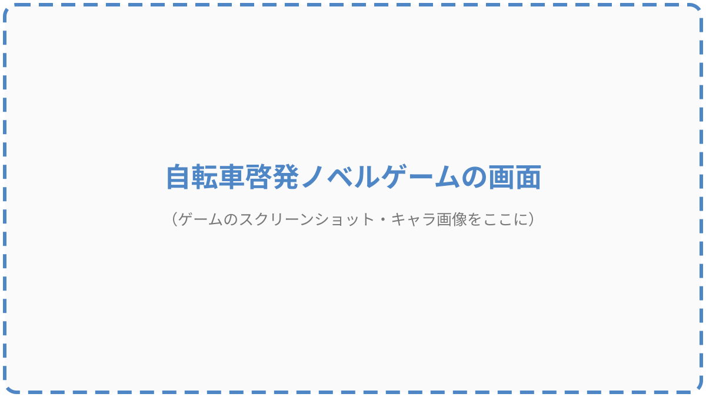

<!-- ゲームのスクリーンショットやキャラ画像に差し替える。ゲームの目的・対象・啓発メッセージを話す -->

---

<!-- _class: projectB -->

# 課題②はこんな動画

| 項目 | 内容 |
|---|---|
| 形 | ゲームの **プレイ映像 ＋ 素材** で作るプロモーション動画 |
| 制作 | **チーム** で役割分担（構成・収録・編集・音・テロップ…） |
| 中身 | ナレーション・台詞・テロップ・BGM・効果音 |
| 納品 | 第15回（1/22）上映会 → 企業へ納品 |

**「ルールを守ろう」の啓発と「遊びたい！」の魅力、両方を1本に**

---

# 学校の課題と何が違う？

| 学校の課題 | 企業連携課題 |
|---|---|
| 先生が見る | **企業の人が見る・使う** |
| 評価されて終わり | **納品して、公開される可能性がある** |
| 「上手いか」で見られる | **「伝わるか・使えるか」で見られる** |

> 完成した動画は、そのまま **ポートフォリオ** になる

---

# 全15回のロードマップ

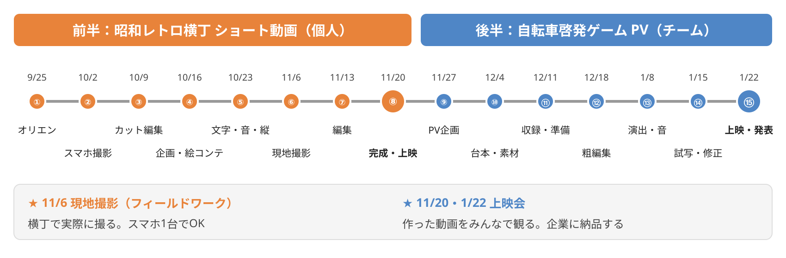

---

# 前半 8回で身につくこと

| 回 | やること |
|---|---|
| ②〜③ | スマホ撮影の基本、Premiereでカット編集 |
| ④〜⑤ | 企画・絵コンテ、テロップ・BGM・縦動画の作り方 |
| ⑥ | **横丁で現地撮影** |
| ⑦〜⑧ | 編集 → 講評 → 改善 → **上映会・納品** |

**第8回が終わった時点で、SNSに出せる縦動画が1本できている**

---

# 後半 7回で身につくこと

| 回 | やること |
|---|---|
| ⑨〜⑩ | PVの企画、台本、素材リスト、チームの役割決め |
| ⑪ | ゲーム画面の収録、素材の受け渡し、権利の確認 |
| ⑫〜⑬ | 粗編集 → 演出・音響で仕上げ |
| ⑭〜⑮ | 試写・相互講評 → **上映会・プレゼン・納品** |

**チームで1本を完成させる経験は、そのまま現場の流れ**

---

# 評価基準

| 評価項目 | 割合 | 内容 |
|---|---|---|
| **制作物** | **40%** | 目的に沿った構成と編集で映像を完成できる |
| **実技** | **30%** | 撮影技法とPremiereを適切に活用できる |
| **修学姿勢** | **30%** | 期限を守り協働し、主体的に改善できる |

> **「期限を守る」「講評を受けて直す」だけで3割。** 才能より習慣

---

# 持ち物と約束

### 毎回の持ち物
ノートPC・電源・マウス・イヤホン（ヘッドホン）・スマートフォン・充電器

### 約束
- **Premiere Proが使える状態** で来る
- 撮影は **安全・施設ルール・肖像権** に配慮する
- 課題データは **各自でバックアップ** する（消えたら泣く）

---

<!-- _class: lead -->

# 参考動画を見てみよう

---

# 参考動画：昭和レトロ系ショート動画

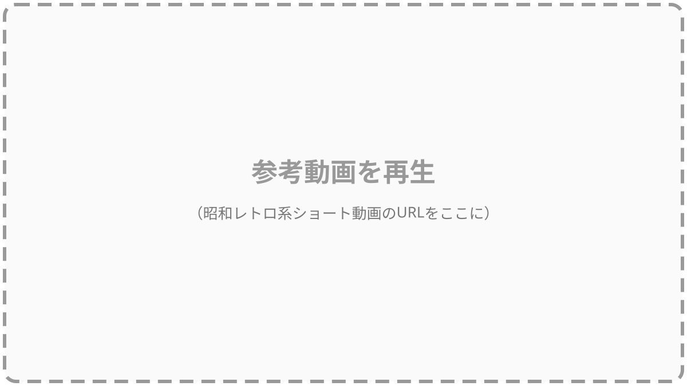

<!-- 2〜3本再生。URLは授業前に用意する -->

---

# 見るときのチェックポイント

### 一緒に数えてみよう

| 見るところ | 問い |
|---|---|
| 最初の **1秒** | 何が映っている？ なぜ止まって見た？ |
| **カット数** | 30秒で何カット？ 1カット何秒？ |
| **文字** | テロップはどこに、何文字？ |
| **音** | BGMの雰囲気は？ 効果音は入っている？ |
| **最後** | 何で終わる？ 店の名前？ 場所？ |

**同じ横丁を撮っても、この設計で「伸びる動画」は変わる**

---

<!-- _class: lead -->

# 映像制作の流れ

---

# 動画ができるまでの7ステップ

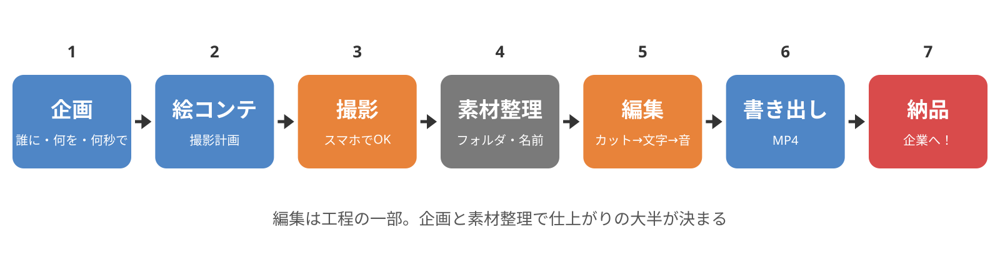

---

# 編集は「工程の一部」でしかない

- **企画** が曖昧だと、撮っても使える素材がない
- **素材整理** をサボると、編集中にファイルが行方不明になる
- **撮影** で足りないカットは、編集では作れない

> 動画がうまい人は、編集がうまい人ではなく
> **「撮る前に決めている」人**

---

<!-- _class: lead -->

# 動画の正体

---

# 動画は「パラパラ漫画」

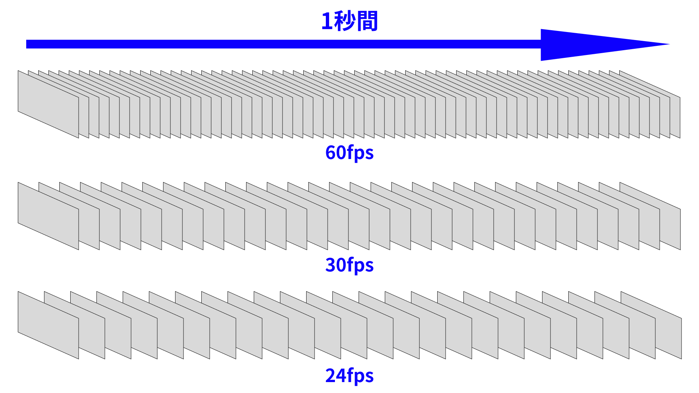

**1秒間に何枚の静止画を見せるか ＝ フレームレート（fps）**

---

# フレームレート（fps）

fps ＝ **F**rames **P**er **S**econd（1秒あたりのコマ数）

| fps | 使われる場面 | 動き |
|---|---|---|
| **24** | 映画・アニメ | 映画らしい質感 |
| **30** | テレビ・多くのネット動画 | 標準的 |
| **60** | スポーツ中継・ゲーム | とても滑らか |

- 高いほど滑らか。ただし **データ量が増える**
- **この授業では主に30fps** を使う

---

# 体感してみよう

## 同じ映像を 10fps / 30fps / 60fps で再生

- 動きの「カクつき」はどこで気になる？
- 30と60、見分けがつく？

<!-- PremierePro/01_fps/ の 10fps.mp4, 30fps.mp4, 60fps.mp4 を続けて再生 -->

**スマホのカメラ設定で「30fps」「60fps」を選べる。次回の撮影で試す**

---

# 解像度

画像を構成する **ピクセル（点）の数**。多いほど鮮明、ただしデータも重い

| 名称 | 横 × 縦 |
|---|---|
| HD | 1280 × 720 |
| **フルHD** | **1920 × 1080**（今いちばん一般的） |
| 4K | 3840 × 2160 |

**スマホは初期設定でフルHD以上が撮れる。機材の心配はいらない**

---

# 縦動画と横動画

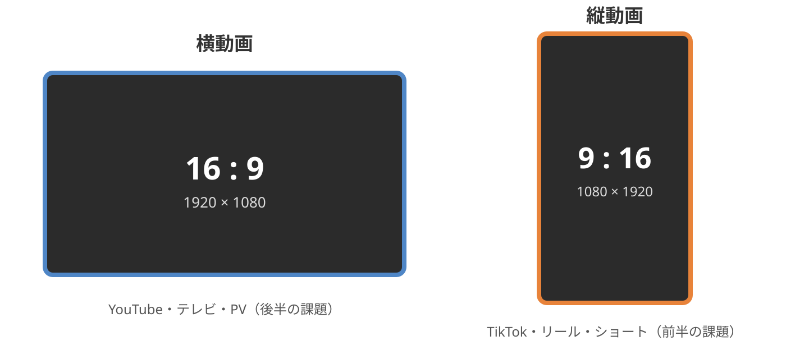

---

# 縦と横、何が変わる？

| | 縦（9:16） | 横（16:9） |
|---|---|---|
| 見る場所 | スマホ縦持ち | テレビ・PC・YouTube |
| 構図 | 人物・看板・奥行き | 風景・複数人・広さ |
| 文字 | 大きく、中央に | 下に、横長に |
| この授業 | **課題①（横丁）** | **課題②（ゲームPV）** |

**撮る前に「縦か横か」を決める。あとから変えると画面が切れる**

---

# 1時間目のまとめ

- この授業では **企業連携課題を2本** 作る（横丁ショート動画・ゲームPV）
- **スマホで撮って、Premiereで編集する**。特別な機材はいらない
- 動画は **パラパラ漫画**。fps・解像度・縦横を撮る前に決める
- 編集は工程の一部。**企画と素材整理** で仕上がりが決まる

### 質問があればどうぞ

<!-- 休憩前に「2時間目はPCとスマホを出して環境確認」と予告 -->

---

<!-- _class: lead -->

# 2時間目

---

<!-- _class: lead -->

# 制作環境の確認

PCとスマホを出してください

---

# Premiere Proを起動しよう

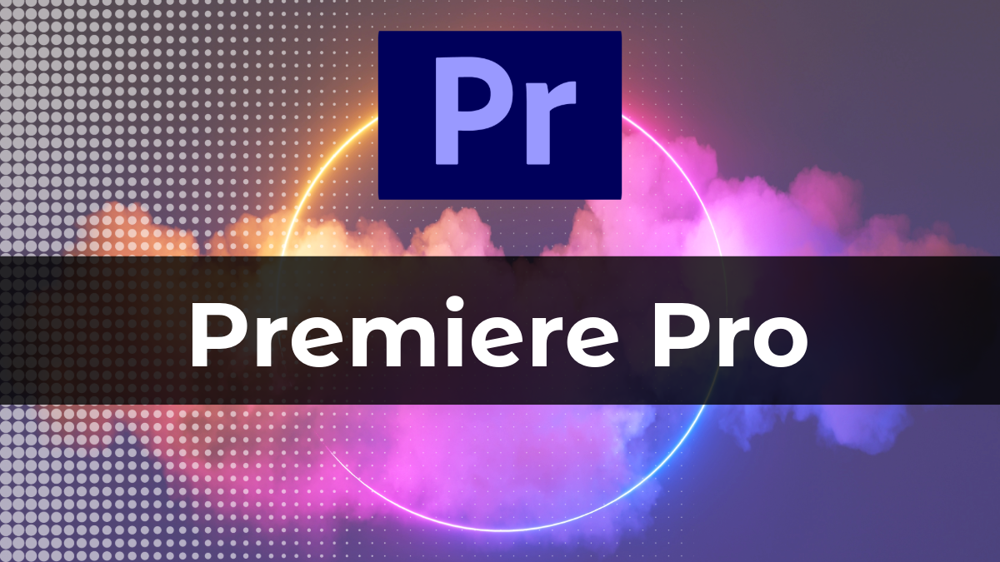

1. **Creative Cloud** にログインできているか
2. **Premiere Pro** が起動するか
3. 起動しない・ログインできない人は **手を挙げる**（あとで個別に対応）

---

# 新機能の案内が出たら閉じる

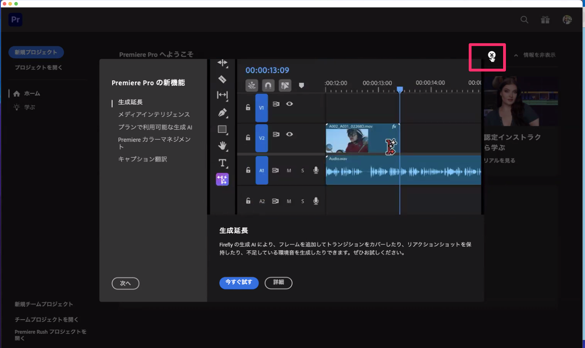

---

<!-- _class: fire -->

# 🔥重要：保存場所をいい加減にしない

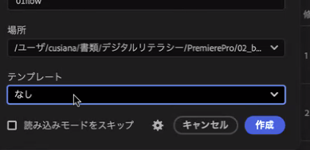

- Premiereは **プロジェクトファイルと素材の場所** をセットで覚えている
- バラバラに保存すると、次に開いたとき **素材が行方不明** になる
- 「場所」は必ず自分で決めたフォルダを指定する。テンプレートは「なし」

---

# 保存場所のルール

### 今日つくるフォルダ構成

```
書類/
└── 動画基礎/
    ├── 01_orientation/     ← 今日
    ├── 02_shooting/        ← 第2回
    └── ...
```

- **回ごとに1フォルダ**。その中に `.prproj` と素材を入れる
- フォルダ名・ファイル名は **半角英数字**（日本語は避ける）
- 動かさない・改名しない・消さない

<!-- Windows/Macそれぞれの「書類」の場所を画面で示す -->

---

# 新規プロジェクトをつくる

1. **新規プロジェクト** をクリック
2. 名前：`01_orientation`
3. 場所：さっき作ったフォルダ
4. テンプレート：**なし**
5. 「読み込みモードをスキップ」は **チェックしない**
6. **作成**

**全員できたら次へ。できない人は手を挙げる**

---

# Premiereの画面は4つのエリア

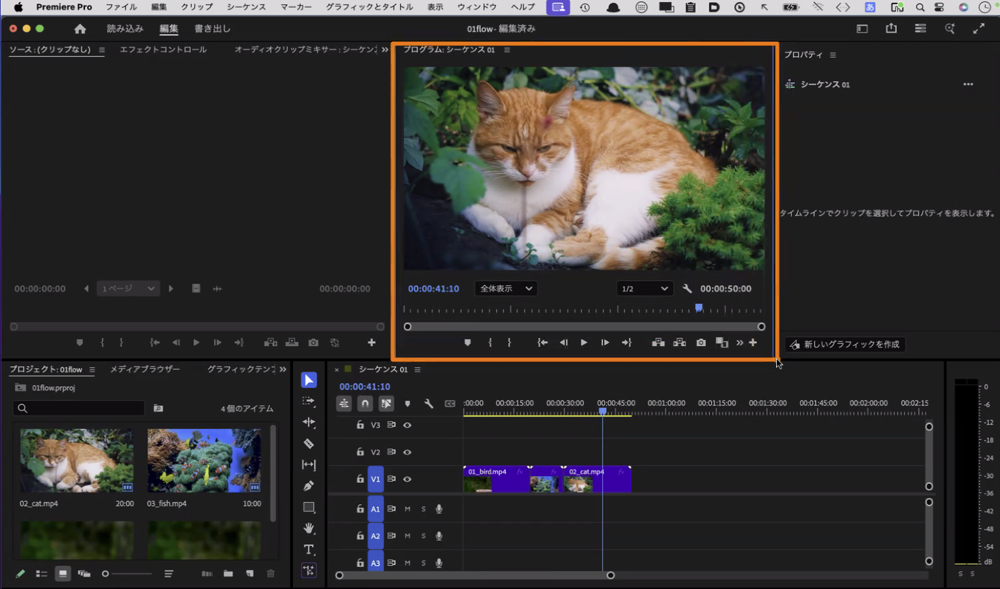

<!-- 左下：プロジェクト（素材置き場）、右上：プログラムモニター（完成画面）、下：タイムライン（編集する場所）、左上：ソース・エフェクト -->

---

# 4つのエリアの役割

| エリア | 場所 | 役割 |
|---|---|---|
| **プロジェクト** | 左下 | 読み込んだ素材の置き場 |
| **タイムライン** | 下 | 素材を並べて編集する場所（＝シーケンス） |
| **プログラムモニター** | 右上 | 完成形を確認する画面 |
| **ソース／エフェクト** | 左上 | 素材の確認・効果の調整 |

**今日は「ある」ことがわかればOK。使い方は第3回から**

---

# 素材の読み込みと再生ヘッド

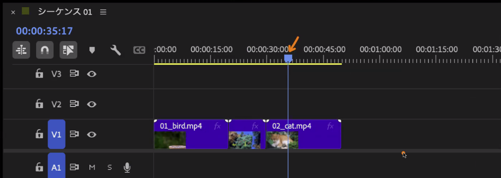

- 青い線が **再生ヘッド**。ここの映像がモニターに映る
- 素材はプロジェクトパネルから **タイムラインにドラッグ**

---

# 書き出し ＝ 動画ファイルにする

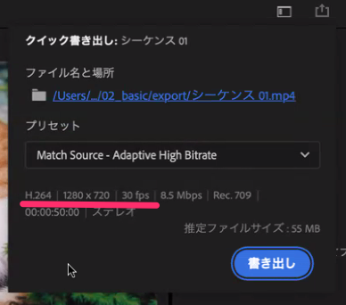

- 形式は **H.264（MP4）**。SNS・YouTube・納品、ぜんぶこれ
- 解像度とfpsは **作業中の設定そのまま**（Match Source）
- 書き出したファイルの場所を **必ず確認** する

---

# スマホのカメラ設定をチェック

| 項目 | 設定 |
|---|---|
| 解像度 | **1080p（フルHD）以上** |
| フレームレート | **30fps**（動きが速いものは60fps） |
| グリッド | **ON**（構図が取りやすくなる） |
| 空き容量 | **5GB以上** を確保（1分のフルHDで約100〜200MB） |

<!-- iPhone: 設定 > カメラ > ビデオ撮影。Android: カメラアプリの設定から -->

**今、自分のスマホで確認してください**

---

# スマホ → PC の転送方法を決める

| 方法 | 向いている人 |
|---|---|
| **AirDrop** | iPhone × Mac |
| **Googleドライブ／Googleフォト** | Android、iPhone × Windows |
| **ケーブル接続** | 大量の素材、確実に送りたいとき |

- 自分の環境で **確実に動く方法を1つ** 決める
- **LINEで送らない**（画質が落ちる）

---

<!-- _class: lead -->

# 著作権・肖像権・AI素材

使っていいもの、ダメなもの

---

# ○×クイズ①

## 好きなアーティストの曲をBGMにして、
## 横丁のショート動画をSNSに投稿してよい？

<!-- 挙手させてから次へ -->

---

# ○×クイズ① 答え：**×**

- 楽曲には **著作権** がある。許可なく使うと権利侵害
- SNSによっては公式に使える曲もあるが、**企業に納品する動画では使えない**
- 使えるのは **利用条件を確認した「フリーBGM」** か **自作**

---

# ○×クイズ②

## 横丁で撮影中、通行人の顔がはっきり映った。
## そのまま使ってよい？

---

# ○×クイズ② 答え：**×**

- 顔が識別できる人には **肖像権** がある
- 原則 **許可を取る**。取れない場合は **映らない構図・ぼかし・カット**
- 店舗の中や商品も、**店の人に一言確認** してから撮る

**フィールドワーク当日、これがいちばん大事なルール**

---

# ○×クイズ③

## 「フリー素材」と書いてあるサイトの画像や音は、
## 何にでも使ってよい？

---

# ○×クイズ③ 答え：**×**

「フリー」の意味はサイトごとに違う。必ず **利用規約** を読む

| 確認すること | 例 |
|---|---|
| **商用利用** | 企業の動画で使える？ |
| **クレジット** | 作者名の表記が必要？ |
| **改変** | 切ったり加工したりしてよい？ |
| **再配布** | 素材そのものを渡してよい？ |

---

# ○×クイズ④

## AIで生成した画像や音楽は、
## 自由に使ってよい？

---

# ○×クイズ④ 答え：**△（条件つき）**

- 生成ツールの **利用規約** を確認する（商用利用の可否、クレジット）
- 既存の作品に **似すぎていないか** を自分でチェックする
- **「何を・どのツールで生成したか」を記録** しておく

> 前期「生成AI基礎」で学んだ **依拠性・類似性** の話が、ここでそのまま生きる

---

# この授業の3つのルール

1. **素材の出典と利用条件を記録する**
   BGM・効果音・フォント・画像・AI生成物、すべて

2. **人と店は、撮る前に一言**
   顔が映る人、店内、商品。許可が取れなければ使わない

3. **納品時にクレジット一覧を添える**
   使った素材をリスト化して提出する

---

# 使ってよい素材源（例）

| 種類 | 例 |
|---|---|
| BGM | DOVA-SYNDROME、甘茶の音楽工房、魔王魂、YouTubeオーディオライブラリ |
| 効果音 | 効果音ラボ、OtoLogic |
| フォント | Adobe Fonts（Creative Cloud に含まれる） |
| 画像・映像 | Adobe Stock 無料コレクション |

**「例」なので、使う前に必ず各サイトの利用規約を確認する**

<!-- 授業前にリンク集を用意し、クラスルームに掲載する -->

---

<!-- _class: lead -->

# ミニ演習

---

# 今日のうちに「一周」しておく

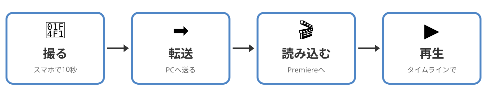

---

# 手順

1. **撮る**：スマホで教室内を **10秒** 撮影（縦でも横でもOK）
2. **転送**：さっき決めた方法でPCに送る → `01_orientation` フォルダに入れる
3. **読み込む**：Premiereの「読み込み」から動画を選ぶ
4. **再生**：タイムラインに置いて、再生ヘッドを動かして再生する

### できたら手を挙げる。できない人には講師が回ります

**これができれば、第2回・第3回でつまずかない**

---

<!-- _class: lead -->

# まとめ

---

# 本日のまとめ

### この授業でやること
- 企業連携課題を **2本** 作る：横丁ショート動画（個人・縦）とゲームPV（チーム・横）
- スマホで撮り、Premiereで編集し、**企業に納品** する

### 動画の正体
- 動画はパラパラ漫画。**fps・解像度・縦横** を撮る前に決める
- 編集は工程の一部。**企画と素材整理** が仕上がりを決める

### 権利
- **出典と利用条件を記録**、**人と店は撮る前に一言**、**納品時にクレジット一覧**

---

# 次回の授業

## 第2回：スマホ撮影の基礎と素材づくり（10/2）

- 画角・構図・カメラワーク
- 教室内で短い素材を撮影する
- 撮影データの整理方法

**スマホを充電して、空き容量を確保して来てください**

---

# 宿題

1. **昭和レトロ系のショート動画を3本** 見つけて、URLと「良いと思った点」をメモする
   （最初の1秒・カット数・文字・音、今日のチェックポイントで見る）

2. **Premiere Proが起動して、動画の読み込みまでできる状態** にしておく

3. スマホの **空き容量5GB以上** を確保しておく

---

<!-- _class: lead -->

# 理解度クイズ

---

<!-- _class: lead -->

# 振り返りシート記入

## 本日の行動目標

1. 授業目標と2つの企業連携課題を理解する
2. スマホ・Premiereの制作環境を確認する
3. 著作権・肖像権・AI素材の扱いを確認する
