<!-- _class: lead -->
<!-- _paginate: false -->

# 動画基礎 第2回
## Premiere基礎① カット編集

2026年10月2日（金）
京都芸術デザイン専門学校
クリエイティブデザイン学科 キャラクターデザインコース

---

<!-- _class: lead -->

# 出席確認のあいだに

第1回の **復習クイズ** をやってください（5問）

<!-- Classroomに掲載した復習クイズ（復習クイズ_第1回.md）。答え合わせは「前回の振り返り」で口頭 -->

---

<!-- _class: hook -->

# 今日の終わりに、
# **音楽つきの30秒動画** を提出する

## 素材5本を並べて、切って、音をつけて、mp4に

---

# 本日の授業目標

1. 素材の **読み込みと管理** を行う
2. **タイムライン** と基本操作を理解する
3. **カット編集** で短い映像を組み立てる

---

# 本日の流れ

### 1時間目
- 復習クイズ（出席確認のあいだに）、前回の振り返り
- 練習素材の準備、新規プロジェクト
- 素材の読み込みと管理
- タイムラインの基本操作、ミニ演習①

### 2時間目
- ハンズオン：カット編集の3つの操作（並べ替え・挿入／削除とギャップ／トリミングと分割）
- 自由編集のヒント（BGM・音量・フェード・トランジション）
- 自由編集：「30秒の動物ムービー」。音楽と演出は自由
- 書き出し → **mp4を提出**
- まとめ、理解度クイズ、振り返りシート

---

<!-- _class: lead -->

# 1時間目

---

# 前回の振り返り

### 手を挙げてください

- **Premiere Pro** が起動する人
- **撮る → 転送 → 読み込む** の一周ができた人

### 前回の3つ

1. 企業連携課題は **2本**（昭和レトロ横丁のショート動画／どきどきサイクリングのPV）
2. Premiereは **保存場所** をいい加減にしない
3. **人と店は、撮る前に一言**

<!-- 起動しない学生は素材配布の間に個別対応 -->

---

<!-- _class: lead -->

# 練習素材の準備

---

# 今日の素材：動物の動画5本

| ファイル | 長さ | 中身 |
|---|---|---|
| `01_bird.mp4` | 20秒 | 餌を食べる小鳥 |
| `02_cat.mp4` | 20秒 | 寝ている猫 |
| `03_fish.mp4` | 10秒 | クマノミ |
| `04_penguin.mp4` | 10秒 | ペンギンの群れ |
| `05_sealion.mp4` | 10秒 | アシカ |

合計 **70秒**。ここから **30秒** の動画を作る

<!-- 配布方法（Classroom / 共有ドライブ）を伝える -->

---

# 保存先をつくる

```
書類/動画基礎/
└── 02_cut/
    ├── footage/      ← 5本の動画をここに
    ├── project/      ← .prproj
    └── export/       ← 書き出した動画
```

- zipを展開すると **フォルダが二重** になることがある。中身を1階層に直す
- **回ごとに1フォルダ**（第1回のルール）。半角英数字
- `footage/` に入れた素材は **動かさない・改名しない・消さない**

<!-- Mac / Windows それぞれの「書類」の場所を画面で示す -->

---

<!-- _class: lead -->

# 新規プロジェクト

---

# 新機能の案内が出たら閉じる

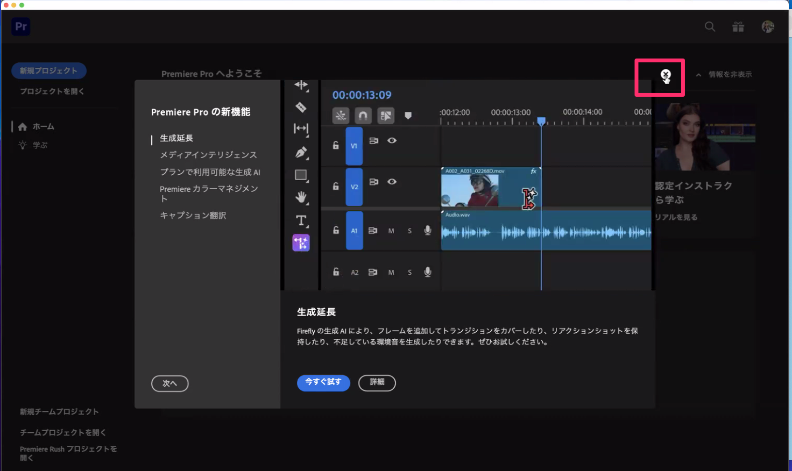

---

<!-- _class: fire -->

# 🔥 新規プロジェクト：場所をいい加減にしない

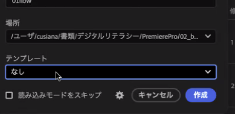

| 項目 | 設定 |
|---|---|
| 名前 | `02_cut` |
| 場所 | `書類/動画基礎/02_cut/project/` |
| テンプレート | **なし** |
| 読み込みモードをスキップ | **チェックしない** |

---

<!-- _class: lead -->

# 素材の読み込みと管理

---

# 読み込みタブ

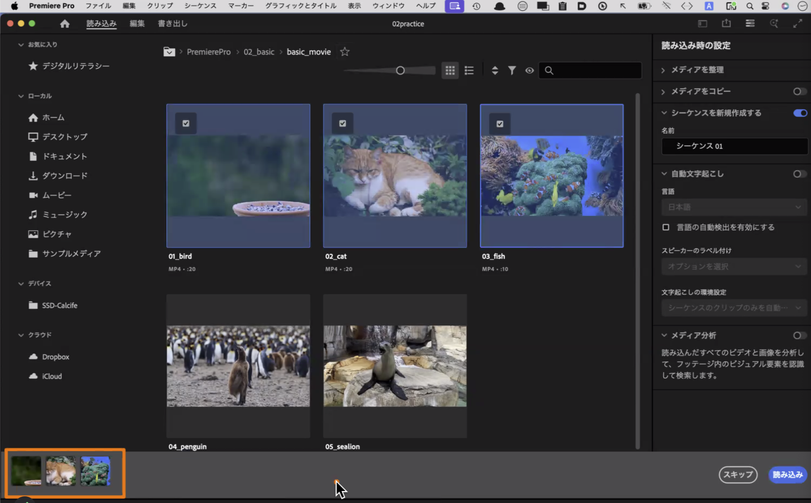

---

# 読み込みの手順

1. 上の **「読み込み」** タブ
2. 左のツリーから `02_cut/footage/` を開く
3. 5本を **クリックして選ぶ**（下に並ぶ）
4. 右の **「シーケンスを新規作成する」が ON** になっているか確認
5. 右下 **「読み込み」**

> 最初に選んだ素材に合わせたシーケンス（30fps）が自動でできる

---

# 読み込んだ直後の画面

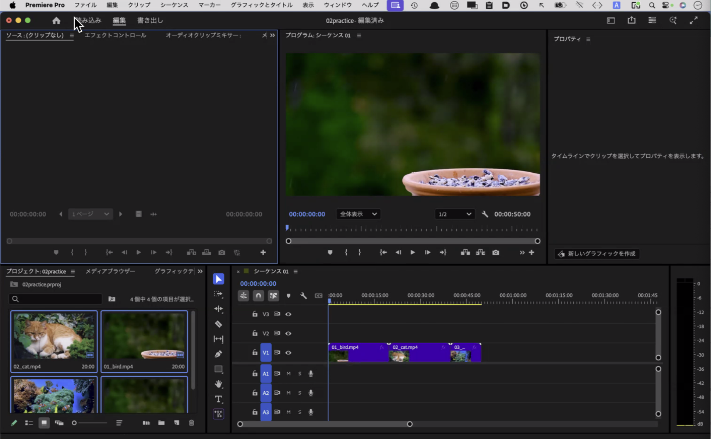

<!-- 左下：プロジェクト、下：タイムライン、右上：プログラムモニター。第1回の「4つのエリア」の復習 -->

---

# プロジェクトパネル：素材の置き場

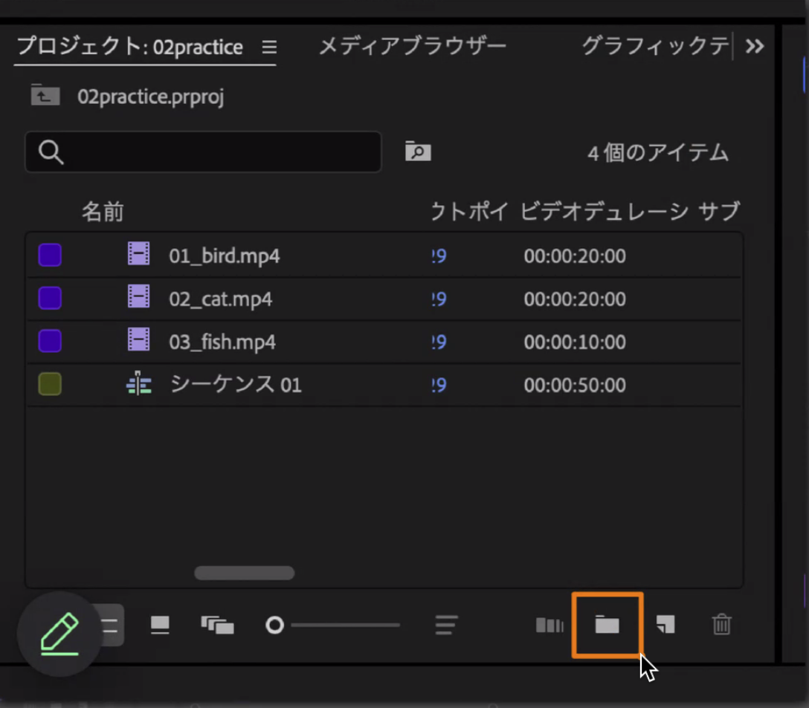

- **フィルムのアイコン** ＝ 素材。**シーケンスのアイコン** ＝ 編集する場所
- 左下のボタンで **リスト表示** に切り替えると、長さ（ビデオデュレーション）やフレームレートが見える

---

# 素材を管理する

- **ビン** ＝ フォルダ。Premiereではフォルダを「ビン」と呼ぶ
  右下のフォルダのボタンで作る。素材が増えたら `movie` `bgm` などで分ける
- うっかりビンに入ってしまったら、**ドラッグで外に出す**
- あとから素材を足すには、プロジェクトパネルの **空きをダブルクリック**
- 素材は **コピーされていない**。元ファイルの場所を参照しているだけ
  → 元ファイルを動かすと **メディアオフライン**（赤い画面）になる

---

<!-- _class: lead -->

# タイムラインの基本操作

---

# シーケンス ＝ タイムライン

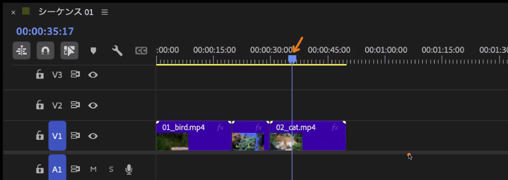

- **V1** に映像、**A1** に音（今日の素材は音なし）
- 青い線が **再生ヘッド**。ここの映像がモニターに映る
- 時間は **時:分:秒:フレーム**（30fpsなら1秒＝30フレーム）

---

# 素材をタイムラインへ

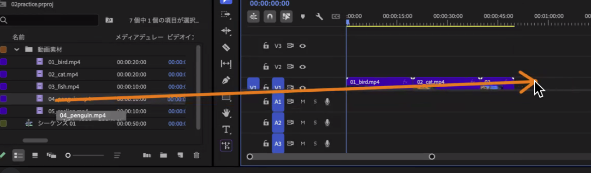

- プロジェクトパネルから **V1へドラッグ**
- 続けて置くと **後ろにつながる**
- <kbd>Shift</kbd> を押しながら再生ヘッドを動かすと、**繋ぎ目に吸着** する

---

# 再生のショートカット

| キー | 動き |
|---|---|
| <kbd>Space</kbd> | 再生／停止 |
| <kbd>J</kbd> <kbd>K</kbd> <kbd>L</kbd> | 巻き戻し／停止／早送り（押すたびに倍速） |
| <kbd>↑</kbd> <kbd>↓</kbd> | 前・次のクリップの頭にジャンプ |
| <kbd>+</kbd> <kbd>-</kbd> | タイムラインを拡大／縮小 |
| <kbd>&#92;</kbd> | 全体を表示 |
| <kbd>⌘S</kbd> / <kbd>Ctrl+S</kbd> | 保存（こまめに） |

**マウスより速い。今日のうちに手に覚えさせる**

---

# タイムコードで移動する

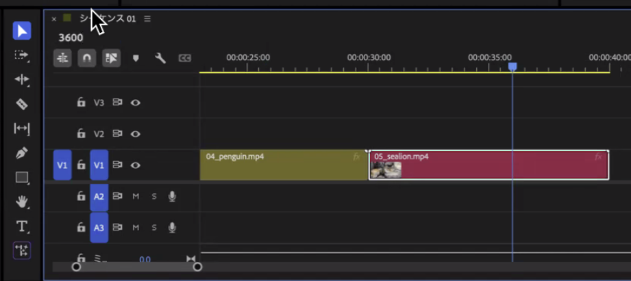

- タイムラインの左上の青い数字をクリックして、**数字を打つ**
- `3600` → **00:00:36:00**（36秒）に再生ヘッドが移動
- `2800` → 28秒。**切りたい位置を正確に決める** ときに使う

---

# クリップの色を変える

- タイムラインのクリップを **右クリック ＞ ラベル ＞ 色**
- 動物ごとに色を変えると、並べ替えたときに **一目で分かる**
- 色は見た目だけ。映像には影響しない

---

<!-- _class: work -->

# ミニ演習①（15分）

1. 5本を **01 → 05 の順** にV1へ並べる
2. 頭から再生して確認する
3. <kbd>Space</kbd> <kbd>J</kbd> <kbd>K</kbd> <kbd>L</kbd> <kbd>↑</kbd> <kbd>↓</kbd> **だけ** で操作してみる
4. <kbd>⌘S</kbd> / <kbd>Ctrl+S</kbd> で保存して **手を挙げる**

---

# 1時間目のまとめ

- 新規プロジェクトは **場所** を決めてから。素材は `footage/` から動かさない
- **読み込み** タブで素材を入れる。シーケンスは自動でできる
- プロジェクトパネルは **素材の置き場**。ビンで分ける
- **タイムライン** に並べて、**再生ヘッド** で見る
- <kbd>Space</kbd> <kbd>J</kbd> <kbd>K</kbd> <kbd>L</kbd>、タイムコード入力、<kbd>⌘S</kbd>

---

<!-- _class: lead -->

# 2時間目

---

<!-- _class: lead -->

# ハンズオン：カット編集の3つの操作

1. 並べ替えと挿入
2. 削除してギャップを詰める
3. トリミングと分割

---

# ① 挿入と上書き

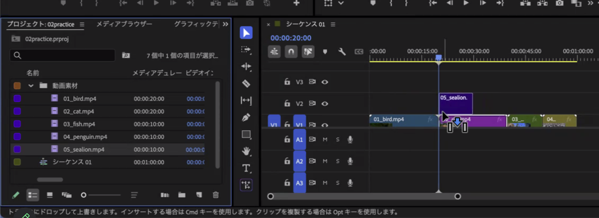

- クリップとクリップの **間** に落とすとき
  - そのまま落とす → **上書き**（下にあったクリップが消える）
  - <kbd>⌘</kbd> / <kbd>Ctrl</kbd> を押しながら落とす → **挿入**（後ろが押し出される）
- 画面の下に出る **ヒントの文字** を読む癖をつける

---

# ① 順番を入れ替える

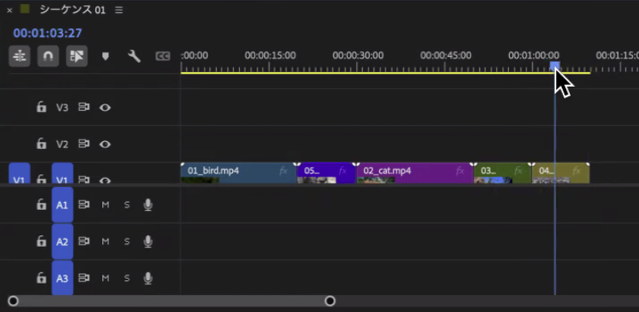

- <kbd>option</kbd>+<kbd>⌘</kbd> / <kbd>Alt</kbd>+<kbd>Ctrl</kbd> を押しながら **ドラッグ**
- <kbd>⌘</kbd> だけでも入れ替わるが、トラックが複数あると **音がずれる**
- 普通にドラッグすると **上書き**。入れ替えは必ずキーを押す

---

# ② 削除すると「ギャップ」が残る

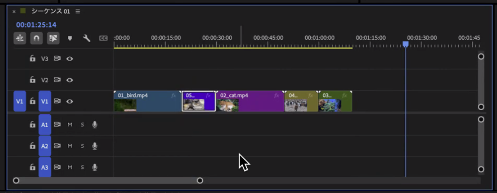

- クリップを選んで <kbd>delete</kbd> → その場所が **空白** になる
- 空白 ＝ **ギャップ**。書き出すと **黒い画面** になる

---

# ② ギャップを詰める3つの方法

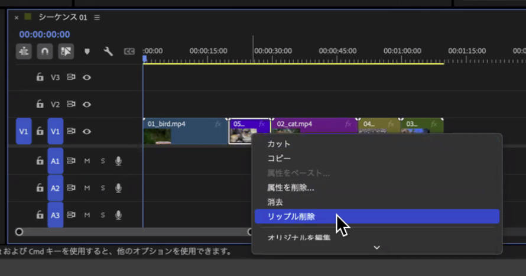

1. ギャップをクリックして <kbd>delete</kbd>
2. クリップを右クリック ＞ **リップル削除**（削除と詰めるを同時に）
3. <kbd>option</kbd>+<kbd>delete</kbd> / <kbd>Alt</kbd>+<kbd>Backspace</kbd>

---

# ③ トリミング ＝ 時間を切る

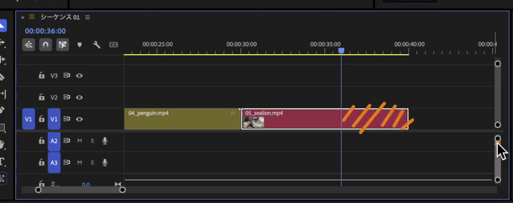

- クリップの **端をドラッグ** して縮める
- Photoshopのトリミングは「画面を切る」。Premiereは **「時間を切る」**
- 縮めても **素材は消えていない**。端を戻せば復活する

---

# ③ トリミング済みかどうかの印

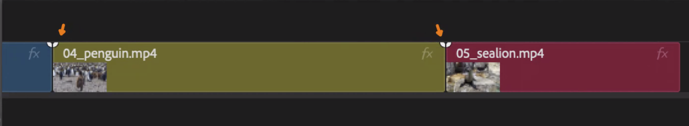

- 端の **小さな三角** ＝ 素材そのまま（まだ切っていない）
- 三角が **消えたら** トリミング済み
- 演習のチェックに使う：「切ったつもりで切れていない」を防ぐ

---

# ③ レーザーツールで分割

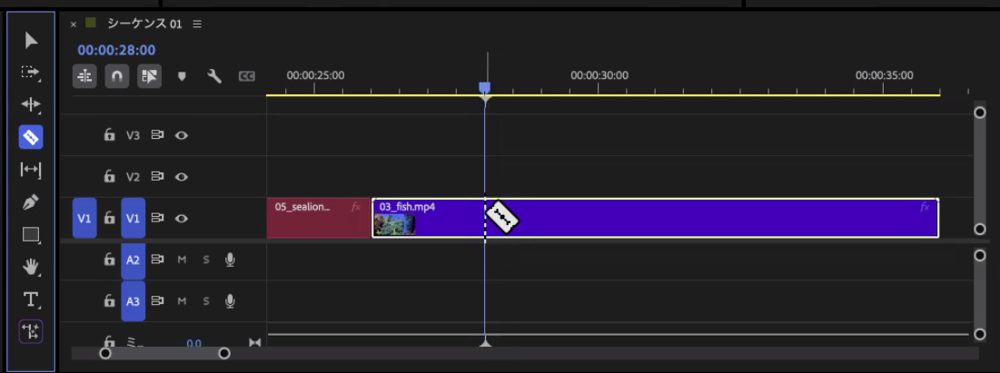

1. タイムコードを打って再生ヘッドを **切りたい位置** に置く
2. <kbd>C</kbd> で **レーザーツール**。再生ヘッドの線の上でクリック
3. <kbd>V</kbd> で **選択ツール** に戻す（戻し忘れがいちばん多い）
4. いらない方を選んで **リップル削除**

---

# ③ リップルツール

- 端をドラッグするときに **ギャップを作らず** 後ろを詰めてくれるツール
- ツールパネルで切り替える。終わったら <kbd>V</kbd> で選択ツールに戻す
- 「トリミング → ギャップ削除」を1回でやりたいときに

---

# 3つの操作まとめ

| 操作 | Mac | Windows |
|---|---|---|
| 間に **挿入** | <kbd>⌘</kbd> ＋ドロップ | <kbd>Ctrl</kbd> ＋ドロップ |
| **入れ替え** | <kbd>option</kbd>+<kbd>⌘</kbd> ＋ドラッグ | <kbd>Alt</kbd>+<kbd>Ctrl</kbd> ＋ドラッグ |
| **削除して詰める** | <kbd>option</kbd>+<kbd>delete</kbd> | <kbd>Alt</kbd>+<kbd>Backspace</kbd> |
| **分割** | <kbd>C</kbd> → クリック → <kbd>V</kbd> | 同じ |
| 保存 | <kbd>⌘S</kbd> | <kbd>Ctrl+S</kbd> |

**ギャップが残っていないか、三角の印が消えているか、を最後に確認**

---

<!-- _class: lead -->

# 自由編集のヒント

ここからは **音楽と演出は自由**。やり方だけ先に見せます

---

# BGMを入れる

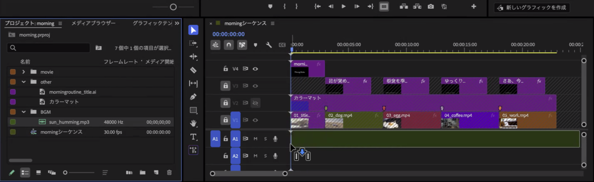

1. BGMファイルを **読み込む**（プロジェクトパネルの空きをダブルクリック）。`bgm` ビンに入れる
2. **A1 にドラッグ**。動画の下に緑の波形が並ぶ
3. 動画より長い分は、再生ヘッドを最後に合わせて **レーザーで切って削除**

---

# 使えるBGM

| 入手先 | 内容 | 注意 |
|---|---|---|
| **配布素材** | `sun_humming.mp3`、`419_BPM78.mp3` | 授業内で使ってよい |
| **フリーBGMサイト** | OpenTracks（旧DOVA-SYNDROME）、甘茶の音楽工房、魔王魂 など | **利用規約を読む**。曲名と出典をメモ |

- 第1回のルール：**出典と利用条件を記録する**。提出のコメント欄に書く
- 好きなアーティストの曲は使えない（著作権）

---

# 音量とフェードアウト

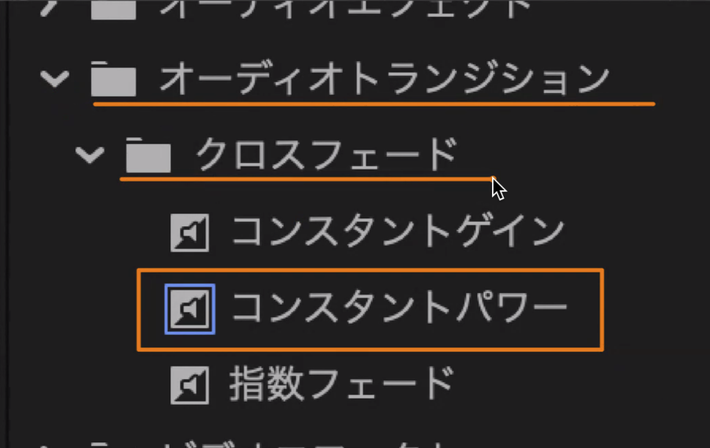

- **音量**：BGMクリップを選んで エフェクトコントロール ＞ ボリューム ＞ **レベル** を下げる。右端のメーターが **-6 を超えない** ように
- **フェードアウト**：エフェクトパネル ＞ オーディオトランジション ＞ クロスフェード ＞ **コンスタントパワー** を、BGMの **終わりの端にドラッグ**
- 曲の途中で **ブツッと切れる** のが、いちばん気になる失敗

---

# つなぎ目とラストの演出

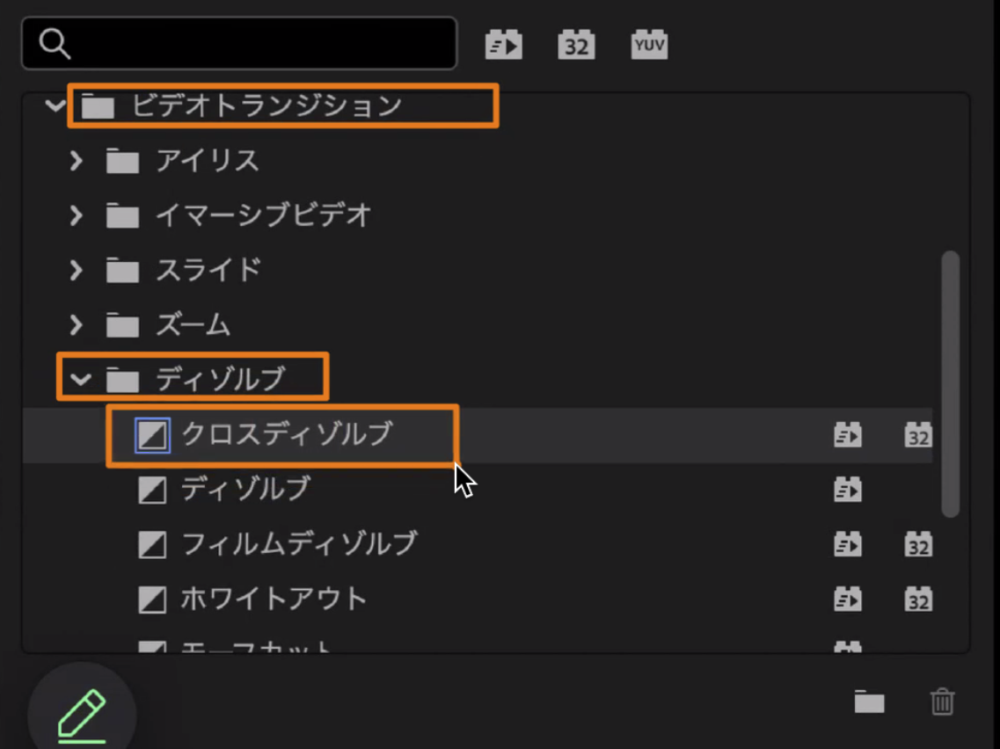

- エフェクトパネル ＞ ビデオトランジション ＞ ディゾルブ ＞ **クロスディゾルブ** を繋ぎ目にドラッグ
- ラストは **暗転** か **ホワイトアウト** を最後の端にドラッグ
- 速度を変える：クリップを右クリック ＞ **速度・デュレーション**
- 文字を入れたい人は <kbd>T</kbd> の文字ツールで画面をクリック（詳しくは第4回）

---

# 演出のルール

> **演出は、カットが決まってから。** 先に並びと長さを固める

- トランジションは **全部の繋ぎ目に付けない**。付けるなら理由を持つ
- 音量は **-6 を超えない**。BGMの終わりは **必ずフェード**
- 迷ったら **フィックスのカット ＋ BGM** だけで十分かっこいい
- 保存はこまめに <kbd>⌘S</kbd> / <kbd>Ctrl+S</kbd>

---

<!-- _class: work -->

# 自由編集「30秒の動物ムービー」（30分）

### 必須
- 5本の素材から **30秒前後（25〜35秒）**
- **4本以上** 使う。順番は自由
- 少なくとも1本は **レーザーで中間を切る**。**ギャップなし**
- **BGMあり**。終わりはフェードアウト

### 自由
- 曲の選択、トランジション、速度、文字、ラストの演出

---

<!-- _class: work -->

# 手順の目安

1. ミニ演習①の並びから、**順番を入れ替える**（option+⌘ / Alt+Ctrl）
2. いらないクリップを **リップル削除**、長いクリップは **端をトリミング**
3. 1本は **タイムコード → レーザー → リップル削除** で中間を切る
4. <kbd>&#92;</kbd> で全体表示。**長さ・ギャップ・三角の印** を確認して保存
5. **BGM** を入れて、長さを合わせて切る → **フェードアウト**
6. 余った時間で **演出**（トランジション、速度、文字）
7. 保存 → **書き出し → 提出**

---

# つまずきやすいところ

| 症状 | 原因 | 直し方 |
|---|---|---|
| クリップが消えた | 上書きで落とした | <kbd>⌘Z</kbd> で戻して、<kbd>⌘</kbd>＋ドロップ |
| 黒い画面が出る | ギャップが残っている | ギャップを選んで <kbd>delete</kbd> |
| 音だけずれた | <kbd>⌘</kbd> だけで入れ替えた | <kbd>option</kbd>+<kbd>⌘</kbd> でやり直す |
| クリップを選べない | レーザーのまま | <kbd>V</kbd> で選択ツールに戻す |
| 素材が赤い画面 | 元ファイルを動かした | `footage/` に戻す |
| BGMが大きすぎる | レベルが 0 のまま | ボリューム ＞ レベルを下げる |
| 曲が途中で切れる | フェードなし | コンスタントパワーを終わりに |

---

<!-- _class: lead -->

# 書き出しと提出

---

# 書き出し ＝ 動画ファイルにする

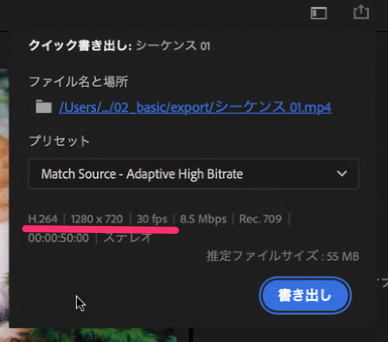

- 右上の **「書き出し」** タブ、またはクイック書き出し
- 形式 **H.264（MP4）**、プリセット **Match Source**
- 場所 `02_cut/export/`
- ファイル名 **`学籍番号_氏名_02cut.mp4`**（例：`2661004_石田_02cut.mp4`）

---

# 書き出したら確認する

1. **Finder / エクスプローラー** で `export/` を開く
2. ダブルクリックで **再生** する（Premiereの外で見る）
3. 長さ・黒い画面がないか・**音が鳴るか**

> 「保存先を変えただけ」では書き出されていない。**ファイルがあるか** を見る

---

<!-- _class: work -->

# 提出（2時間目のうちに）

| 項目 | 内容 |
|---|---|
| 提出先 | Classroom「第2回 30秒の動物ムービー」 |
| ファイル | `学籍番号_氏名_02cut.mp4` |
| 締切 | **今日の2時間目が終わるまで** |
| コメント欄 | 使ったBGMの **曲名と出典**（配布素材なら「配布：sun_humming.mp3」） |

- 提出できたら **手を挙げる**。講師が確認します
- 間に合わない人は、**できているところまで** 書き出して提出する
- 提出物は **制作物の評価** の対象。期限内の提出は **修学姿勢** に入る

---

<!-- _class: lead -->

# まとめ

---

# 本日のまとめ

### 読み込んで管理する
- 場所を決めて新規プロジェクト。`footage/` の素材は動かさない。読み込みタブ → プロジェクトパネル（ビン）

### 並べて、切ってつなぐ
- タイムラインに並べ、再生ヘッドと <kbd>Space</kbd> <kbd>J</kbd> <kbd>K</kbd> <kbd>L</kbd> で見る
- 挿入は <kbd>⌘</kbd>、入れ替えは <kbd>option</kbd>+<kbd>⌘</kbd>、削除はリップル削除、分割はレーザー（<kbd>C</kbd> → <kbd>V</kbd>）。ギャップを残さない

### 音をつけて、書き出す
- BGMはA1へ。音量は -6 以下、終わりはフェード
- H.264で書き出し、Premiereの外で再生してから提出

---

# 次回の授業

## 第3回：スマホ撮影の基礎と素材づくり（10/9）

- 画角・構図・カメラワーク
- 教室内で短い素材を撮影する
- 撮影データの整理方法

### 次回の持ち物
ノートPC・電源・マウス・イヤホン・**充電したスマホ（空き容量5GB以上）**

---

<!-- _class: lead -->

# 理解度クイズ

---

<!-- _class: lead -->

# 振り返りシート記入

## 本日の行動目標

1. 素材の読み込みと管理を行う
2. タイムラインと基本操作を理解する
3. カット編集で短い映像を組み立てる
