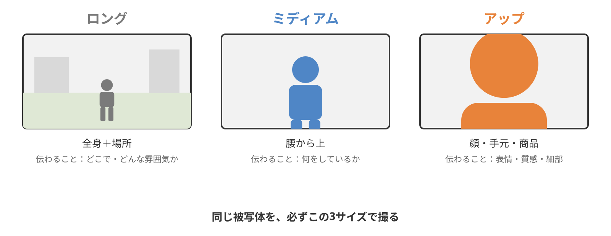
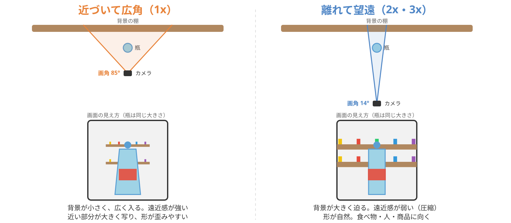
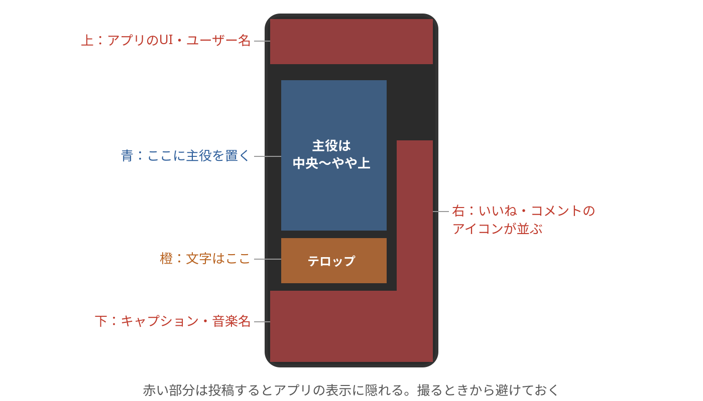
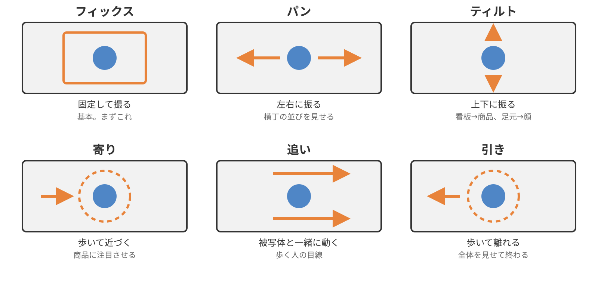
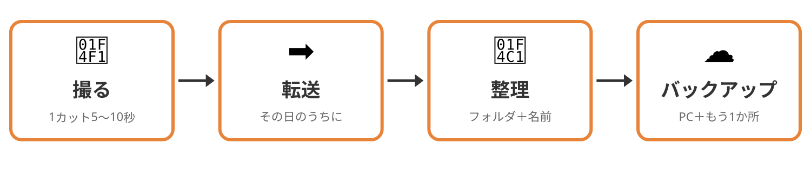

<!-- _class: lead -->
<!-- _paginate: false -->

# 動画基礎 第3回
## スマホ撮影の基礎と素材づくり

2026年10月9日（金）
京都芸術デザイン専門学校
キャラクターデザインコース

---

<!-- _class: lead -->

# 出席確認のあいだに

第2回の **復習クイズ** をやってください（5問）

<!-- Classroomに掲載した復習クイズ（復習クイズ_第2回.md）。答え合わせは「前回の振り返り」で口頭 -->

---

<!-- _class: hook -->

# 今日撮った素材を、
# 来週 **縦動画に仕上げる**

## 第4回の「文字・音・縦動画」は、今日の素材で行います

---

# 本日の授業目標

1. **画角・構図・カメラワーク** を理解する
2. 教室内で **短い素材を撮影** する
3. **撮影データの整理方法** を身につける

---

# 本日の流れ

### 1時間目
- 復習クイズ（出席確認のあいだに）、前回の振り返り
- 動画は「カット」の積み重ね
- 画角（3つのショットサイズ）／構図／カメラワーク
- 撮影演習の説明

### 2時間目
- 撮影演習（35分）
- 撮影データの整理（フォルダ・名前・転送・バックアップ）
- 演習：転送 → 整理 → Googleドライブに保存 → **URLを提出**
- 相互チェック、まとめ、理解度クイズ、振り返りシート

---

<!-- _class: lead -->

# 1時間目

---

# 前回の振り返り

### 手を挙げてください

- 前回の **カット編集** で短い映像を組み立てられた人
- **書き出し** までできた人

### これまでの3つ

1. Premiereは **保存場所** をいい加減にしない（第1回）
2. **人と店は、撮る前に一言**（第1回）
3. 素材は **読み込んで、並べて、切る**（第2回）

<!-- Premiereが動いていない学生は2時間目の撮影演習中に個別対応 -->

---

<!-- _class: lead -->

# 動画は「カット」の積み重ね

---

# 見本動画①を「カット」で数える

<div class="cols">
<div class="col">
<p>横丁を模した3D空間で作った、<b>23秒</b> の縦動画</p>
<h3>数えること</h3>
<ul>
<li><b>何回</b> 画面が切り替わる？</li>
<li>今のカットは <b>寄り？ 引き？</b></li>
<li><b>動いている</b> カットと <b>止まっている</b> カット、どっちが多い？</li>
</ul>
</div>
<video class="v-portrait" src="videos/10_sample_short.mp4" poster="images/poster_10_sample_short.png" controls playsinline preload="metadata"></video>
</div>

<!-- 素版を再生して数えさせる。次のスライドのカット番号入りで答え合わせ -->

---

# 答え合わせ：8カット・23秒

<div class="cols">
<div class="col">
<table>
<thead><tr><th>#</th><th>内容</th><th>動き</th><th>秒</th></tr></thead>
<tbody>
<tr><td>1</td><td>ロング（店の全体）</td><td>フィックス</td><td>3.0</td></tr>
<tr><td>2</td><td>ミディアム（棚）</td><td>パン</td><td>3.0</td></tr>
<tr><td>3</td><td>ミディアム（瓶）</td><td>フィックス</td><td>2.5</td></tr>
<tr><td>4</td><td>アップ（離れて望遠）</td><td>フィックス</td><td>2.5</td></tr>
<tr><td>5</td><td>看板 → 商品</td><td>ティルト</td><td>3.0</td></tr>
<tr><td>6</td><td>瓶へ</td><td>寄り</td><td>3.5</td></tr>
<tr><td>7</td><td>駄菓子のアップ</td><td>フィックス</td><td>2.0</td></tr>
<tr><td>8</td><td>全体へ</td><td>引き</td><td>3.5</td></tr>
</tbody>
</table>
<p>止まっているカットと動くカットが4つずつで、1カットは <b>2〜3.5秒</b></p>
</div>
<video class="v-portrait" src="videos/10_sample_short_annotated.mp4" poster="images/poster_10_sample_short_annotated.png" controls playsinline preload="metadata"></video>
</div>

---

# 見本動画②：本物の横丁の写真で

<div class="cols">
<div class="col">
<p>公式サイトの写真とロゴで作った、<b>30秒・10カット</b> の縦動画</p>
<h3>見るところ</h3>
<ul>
<li>ロング → ミディアム → アップ → ロング と、<b>画角がどう動くか</b></li>
<li>写真は止まっているのに <b>寄り・引き・パン</b> に見えるのはなぜか</li>
<li>文字・ステッカー・切り替えの <b>派手さ</b> は、課題①ではどこまで使うか</li>
</ul>
</div>
<video class="v-portrait" src="videos/11_yokocho_mg.mp4" poster="images/yokocho_mg_poster.png" controls playsinline preload="metadata"></video>
</div>

<!-- 写真の拡大縮小と移動で動きを作っている（ケンバーンズ）。課題①は撮影した動画が主役なので、文字と切り替えは控えめでよい、と伝える -->

---

<!-- _class: work -->

# 本物も探してみよう（3分）

1. 自分のスマホで、TikTok・リール・ショートを **「駄菓子屋」「昭和レトロ」** で検索する
2. 1本選んで、**カット数・最初の1秒・縦か横か** をメモする
3. 2〜3人に、見つけた動画を見せてもらう

<!-- 横丁の公式Instagramには動画がない（2026-10-09 確認済み）。学生が探したものを見本にする -->

---

# 30秒の動画の中身

| | 目安 |
|---|---|
| カット数 | **8〜12カット** |
| 1カットの長さ | **2〜4秒** |
| 撮るときの長さ | **5〜10秒**（編集で切る） |

> 短く撮ると編集で困るので、**長めに撮って、あとで切る**

---

<!-- _class: lead -->

# 画角（ショットサイズ）

---

# 3つのショットサイズ



---

# 見本動画：3つのショットサイズ

<video class="v-wide" src="videos/01_shot_sizes.mp4" poster="images/poster_01_shot_sizes.png" controls playsinline loop preload="metadata"></video>

<!-- 左がカメラの画面、右がカメラの位置。距離を変えるだけで「伝わること」が変わる -->

---

# サイズごとに「伝わること」が違う

| サイズ | 映るもの | 伝わること | 横丁なら |
|---|---|---|---|
| **ロング** | 全身＋場所 | どこで・どんな雰囲気か | 店の入口、通路全体 |
| **ミディアム** | 腰から上 | 何をしているか | 棚の前で選ぶ手元と商品 |
| **アップ** | 顔・手元・商品 | 表情・質感・細部 | 駄菓子のパッケージ、ラムネの泡 |

> **同じ被写体を必ず3サイズで撮っておくと、編集で困らない**

---

# 同じ大きさでも、画角で見え方が変わる



---

# 見本動画：近づく vs 離れて望遠

<video class="v-wide" src="videos/09_perspective.mp4" poster="images/poster_09_perspective.png" controls playsinline loop preload="metadata"></video>

<!-- 瓶の大きさを同じに保ったまま、カメラが0.4m→3mに下がり、画角が85°→14°に狭まる。変わるのは背景と形だけ -->

---

# 望遠効果：遠近感は「距離」で決まる

| | 近づいて広角（1x） | 離れて望遠（2x・3x） |
|---|---|---|
| 遠近感 | **強い**（手前が大きく、奥が小さく写る） | **弱い**（奥が迫ってきて圧縮される） |
| 背景 | 小さく広く入る | 大きく狭く入るので、整理しやすい |
| 形 | 近い部分が膨らみ、端が歪む | **自然** で、歪みが少ない |
| 向く被写体 | 広さ・迫力・通路の奥行き | **食べ物・人の顔・商品** |

> レンズは拡大するだけで、遠近感を決めるのは **カメラと被写体の距離**

---

# スマホでの使い分け

- **1x・2x・3x のボタン** はカメラ（レンズ）の切り替えなので、画質は落ちない
- ボタンの **間をピンチで動かす** のはデジタルズームで、画質が落ちる
- 駄菓子・ラムネ・顔を撮るなら **少し離れて 2x・3x** にすると、形が自然で背景もすっきりする
- 横丁の通路や店構えなら **近づいて 1x** にすると、広がりと迫力が出る
- ボタンの倍率は機種によって違うので、**自分のスマホで確認** しておく

<!-- 2xがクロップ（デジタル）の機種もあるが、授業では「ボタン＝OK、ピンチの中間＝避ける」で統一する -->

---

<!-- _class: work -->

# ミニ演習①「同じものを3サイズ＋望遠」（5分）

1. 机の上のものを **1つ** 選ぶ（ペンケース、水筒、なんでも）
2. **縦** で、ロング → ミディアム → アップ を **各5秒**
3. アップをもう1本、**離れて 2x（3x）** で撮り、近づいた1xのアップと **背景と形** を見比べる
4. 撮ったら4本続けて見返す

**「アップだけ」「ロングだけ」になりがちだが、3つ揃ってはじめて動画になる**

---

<!-- _class: lead -->

# 構図

縦の画面を、どう使うか

---

# 縦動画のセーフエリア



---

# 縦で気をつけること

- 主役は **中央〜やや上**（グリッドの上の横線を目安に、ラベルや顔を置く）
- **下1/4** と **右端** は空ける（アプリの表示に隠れる）
- 主役の下、下の横線のあたりに **テロップの場所** を空けておく
- 横の広がりは、**動き（パン）** で見せる

**課題①が縦動画なので、今日はすべて縦で撮る**

---

# 構図の基本5つ

1. **主役の位置**：中央〜やや上に置き、下にテロップの場所を空ける
2. **余白**：動く方向・視線の先を空ける
3. **水平**：傾きはいちばん目につく失敗なので、グリッドで取る
4. **奥行き**：手前に何か入れたり、斜めから撮ったりする
5. **引き算**：余計なものを入れず、迷ったら寄る

---

<!-- _class: work -->

# ミニ演習②「テロップの場所を空けて撮る」（3分）

1. さっきの被写体を、**縦・グリッドON** で
2. ラベルや顔を **上の横線のあたり** に置く（少し下から、机を手前に入れる）
3. **下の横線より下** と **右端** が空いているか見てから、**5秒** フィックス
4. 撮った動画の下の方を **指で隠して**、文字が入る場所があるか確かめる

**撮るときから、文字の場所を決めておく**

---

<!-- _class: lead -->

# カメラワーク

---

# 6つの動き



---

# 見本動画：カメラワーク

<div class="vgrid">
<figure><video src="videos/02_fix.mp4" poster="images/poster_02_fix.png" controls playsinline loop muted preload="metadata"></video><figcaption>フィックス</figcaption></figure>
<figure><video src="videos/03_pan.mp4" poster="images/poster_03_pan.png" controls playsinline loop muted preload="metadata"></video><figcaption>パン</figcaption></figure>
<figure><video src="videos/04_tilt.mp4" poster="images/poster_04_tilt.png" controls playsinline loop muted preload="metadata"></video><figcaption>ティルト</figcaption></figure>
<figure><video src="videos/05_dolly_in.mp4" poster="images/poster_05_dolly_in.png" controls playsinline loop muted preload="metadata"></video><figcaption>寄り</figcaption></figure>
<figure><video src="videos/06_tracking.mp4" poster="images/poster_06_tracking.png" controls playsinline loop muted preload="metadata"></video><figcaption>追い</figcaption></figure>
<figure><video src="videos/07_dolly_out.mp4" poster="images/poster_07_dolly_out.png" controls playsinline loop muted preload="metadata"></video><figcaption>引き</figcaption></figure>
</div>

<!-- 俯瞰図で「位置が変わる動き（寄り・追い・引き）」と「向きだけ変わる動き（パン・ティルト）」の違いを指差す -->

---

# 動かすときのルール

> **動くなら、始まりと終わりで2秒止める**

- 止め → 動き → 止め、で撮ると編集で切りやすい
- 自分が「遅すぎる」と思う速さで動かすと、ちょうどいい
- 基本はフィックスで、**目的のない動きはしない**

### スマホでやらないこと
- **撮りながらのピンチズーム**は画質が落ちるので、倍率は撮る前に **1x／2x／3x のボタン** で決め、寄るときは **足で** 寄る
- 速すぎるパン、ぐるぐる回す

---

# 見本動画：速さの違い

<div class="vpair">
<figure><video src="videos/03_pan.mp4" poster="images/poster_03_pan.png" controls playsinline loop muted preload="metadata"></video><figcaption>3秒で振る</figcaption></figure>
<figure><video src="videos/08_ng_pan_fast.mp4" poster="images/poster_08_ng_pan_fast.png" controls playsinline loop muted preload="metadata"></video><figcaption>NG：0.5秒で振る</figcaption></figure>
</div>

同じ「止め → 動き → 止め」でも、**動きが0.5秒** だと何が映ったか分からない

---

# 持ち方と手ブレ

| やること | 理由 |
|---|---|
| **両手** で持つ、**脇を締める** | ブレの半分はこれで消える |
| **肘を体につける** | 腕が三脚になる |
| 歩くときは **膝で吸収**、すり足 | 上下の揺れを消す |
| **壁・机・柱** に体を固定 | フィックスが安定する |
| **手ブレ補正ON** | 設定で確認 |

<!-- 講師がその場でデモ。悪い持ち方→良い持ち方 -->

---

# 光

- **窓を背にしない**（逆光で被写体が真っ黒になる）
- 被写体に **光が当たる向き** に自分が回る
- 蛍光灯の下は色が変わるので、**窓際** の方が撮りやすい
- 横丁は店内が暗めなので、**明るい場所でアップ** を撮っておく

<!-- 逆光と順光の比較クリップがあれば再生 -->

---

# 音

- **風** と **話し声** はあとで消せない
- マイクは本体の **下** にあるので、手で塞がない
- 環境音（ざわめき、ラムネの音、レジの音）は **素材として使える**
- 静かなカットも撮っておく（BGMを乗せやすい）

---

# 1時間目のまとめ

- 動画は **8〜12カット** の積み重ねなので、**5〜10秒** で撮って編集で切る
- **3サイズ**（ロング・ミディアム・アップ）で同じ被写体を撮る
- **遠近感は距離で決まる** ので、食べ物・顔・商品は少し離れて 2x／3x で撮る
- 縦では主役を **中央〜やや上** に置いて下にテロップの場所を空け、**余白・水平** も忘れない
- 動くなら **始まりと終わりで2秒止め**、撮りながらのズームは使わない
- **両手・脇・肘** で固定し、窓を背にしない

---

<!-- _class: work -->

# 撮影演習のお題

## 「教室（校内）の"推し"を30秒で紹介する」ための素材を撮る

- 被写体は **モノ** 中心（文房具、掲示物、自販機、窓の景色…）
  → 横丁で駄菓子や看板を撮る練習になる
- 人を撮るなら **本人に一言** かけ、顔を出したくない人は手元だけにする
- **すべて縦**

---

<!-- _class: work -->

# 必須カット（8〜10カット）

- ☐ 同じ被写体の **3サイズ**（ロング・ミディアム・アップ）
- ☐ **テロップの場所を空けた** カット 1つ以上
- ☐ **フィックス** 5カット以上
- ☐ **パン・ティルト・寄り** 各1カット（始まりと終わりで2秒止める）
- ☐ 各カット **5〜10秒**、前後に **1秒の余白**

**チェックリストは撮りながら確認し、スプレッドシートにチェックを入れる**

---

<!-- _class: work -->

# 撮影のルール

- 撮影OKエリア：**どこまで？**
- 他の授業の **邪魔をしない** ように、静かに撮る
- 人を撮るなら **撮る前に一言**（前回の実践）
- 縦で統一
- **残り20分** で教室に戻る（PCへの転送があるので）

### 質問があればどうぞ

---

<!-- _class: lead -->

# 2時間目

---

<!-- _class: lead -->

# 撮影演習（35分）

スタート

<!-- 講師2名で巡回。よく見るつまずき：逆光、傾き、速すぎるパン、ズーム、1カットが短すぎる。早く終わった学生には「別の構図で」「追いに挑戦」 -->

---

<!-- _class: lead -->

# 撮影データの整理

---

# 撮ったあとにやること



---

# なぜ整理するのか

- **保存場所** が重要
- 素材が行方不明 ＝ **編集できない**
- 撮影が増えるほど「あの動画どこ？」が起きる
- **撮影した日のうちに** 整理する

> 整理は編集の一部で、ここまでが「撮影」

---

# フォルダ構成

```
書類/動画基礎/
└── 03_shooting/
    ├── footage/      ← 撮影素材（元データなので、いじらない）
    ├── project/      ← .prproj（第4回で作る）
    ├── export/       ← 書き出した動画
    └── notes.txt     ← 撮影メモ
```

- フォルダは **作品ごとに1つ** とし、第3回と第4回で2週かけて作る縦動画は、来週もこのフォルダを使って `project/` に .prproj を作る
- 元データは `footage/` に入れたら **動かさない・改名しない・消さない**

---

# ファイル名のルール

## `日付_場所_内容_連番`

```
20261002_classroom_pencase_01.mp4
20261002_classroom_pencase_02.mp4
20261002_hallway_vending_01.mp4
```

- **半角英数字**、スペースなし、連番は2桁
- `IMG_4567.MOV` のままだと、来週には何を撮ったか分からなくなる

---

# 転送とバックアップ

### 転送
- 第1回で決めた方法で、**まとめて** 送る
- **画質を落とさない設定** で（LINEは使わない）

### バックアップ
- PCに加えて **Googleドライブ** にも保存し、今日はそのフォルダの **URLを提出** する
- 2か所に入ったことを確認してから、スマホから消す
- スマホの空き容量を常に確保しておく

---

# 撮影メモ（notes.txt）

3行でいいので、**来週の自分** に向けて書く

```
2026/10/02 教室・廊下
ペンケース3サイズ、自販機のパン、窓の景色ティルト
自販機は逆光で暗い → 明るい時間に撮り直したい
```

- 何を・どこで・どう撮ったか
- 使えそうなカット
- 失敗と理由（次に活きる）

---

<!-- _class: work -->

# Googleドライブに保存して提出

| 項目 | 内容 |
|---|---|
| フォルダ名 | **`学籍番号_氏名_03shooting`**（例：`2661004_石田_03shooting`） |
| 入れるもの | リネーム済みの素材（`20261009_classroom_pencase_01.mp4` …）と `notes.txt` |
| 共有設定 | フォルダを右クリック ＞ 共有 ＞ **「リンクを知っている全員」が閲覧者** |
| 提出先 | Classroom「第3回 撮影素材」に **フォルダのURL** を貼る |
| 締切 | **今日の2時間目が終わるまで** |

- 提出した素材は **制作物の評価** の対象になり、期限内に出せたかは **修学姿勢** の評価に入る
- 来週はこのフォルダの素材で縦動画を仕上げるので、**PCとドライブの両方** に残しておく

---

<!-- _class: work -->

# 演習：転送 → 整理 → 提出（22分）

1. 今日の素材を **PCに転送** する
2. `03_shooting/footage/` に入れる
3. ルール通りに **リネーム**（最低でも3サイズの3本）
4. Googleドライブに `学籍番号_氏名_03shooting` を作り、**素材をアップロード**（待っている間に次へ）
5. `notes.txt` に **撮影メモ** を3行書いて、同じフォルダに入れる
6. **URLをClassroomの第3週課題に提出**

---

<!-- _class: work -->

# 相互チェック（10分）

1. 隣の人と **ベスト1カット** を見せ合う
2. 「なぜ良いか」を今日の言葉で言う
   **サイズ・構図・動き・光** のどれか
3. 相手のカットの **良い点を1つ** 言う

**「なんとなく良い」を言葉にできると、次から狙って撮れる**

---

<!-- _class: lead -->

# まとめ

---

# 本日のまとめ

### 撮る
- **3サイズ** で同じ被写体を、**5〜10秒** ずつ撮って編集で切る
- **遠近感は距離で決まる** ので、食べ物・顔・商品は少し離れて 2x／3x、広さと迫力は近づいて 1x で撮る
- 縦では主役を **中央〜やや上** に置いてテロップの場所と右端を空け、**余白・水平** も忘れない
- 動くなら **始まりと終わりで2秒止め**、撮りながらのズームは使わない

### 整える
- **両手・脇・肘** で固定し、窓を背にせず、マイクを塞がない

### 整理する
- `footage/` に入れて `日付_場所_内容_連番` でリネームし、**Googleドライブにも保存して URL を提出** する

---

# 次回の授業

## 第4回：Premiere基礎② 文字・音・縦動画（10/16）

- 縦横比とSNS向けの画面設計
- テロップ・BGM・効果音を配置する
- **今日の素材** で短い縦動画を書き出す

### 次回の持ち物
ノートPC・電源・マウス・イヤホン・**今日の素材が入ったPC**

---

<!-- _class: lead -->

# 理解度クイズ

---

<!-- _class: lead -->

# 振り返りシート記入

## 本日の行動目標

1. 画角・構図・カメラワークを理解する
2. 教室内で短い素材を撮影する
3. 撮影データの整理方法を身につける
